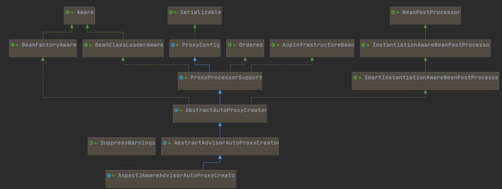

# Spring

## IOC

### 容器启动实现类

+ ClassPathXmlApplicationContext
+ FileSystemXmlApplicationContext
+ AnnotationConfigApplicationContext

### 给容器注册组件的方式

+ 包扫描+组件标注注解（@Controller/@Service/@Repository/@Component）[自己写的类]

+ @Bean[导入的第三方包里面的组件]

+ @Import[快速给容器中导入一个组件]

  + ```java
    // 使用Import注解
    @Import({Color.class, MyImportSelector.class, MyImportBeanDefinitionRegistrar.class})
    
    // 实现ImportSelector
    public class MyImportSelector implements ImportSelector {
    
    
        public String[] selectImports(AnnotationMetadata annotationMetadata) {
            return new String[]{"com.lee.component.Blue"};
        }
    }
    
    // 实现了ImportBeanDefinitionRegistrar接口的实现
    public class MyImportBeanDefinitionRegistrar implements ImportBeanDefinitionRegistrar {
        public void registerBeanDefinitions(AnnotationMetadata importingClassMetadata, BeanDefinitionRegistry registry, BeanNameGenerator importBeanNameGenerator) {
                final RootBeanDefinition rootBeanDefinition = new RootBeanDefinition(RainBow.class);
                registry.registerBeanDefinition("rainBow", rootBeanDefinition);
        }
    }
    
    ```


+ 使用Spring提供的 FactoryBean（工厂Bean）

  ```java
  public class ColorFactory  implements FactoryBean<Color> {
      public Color getObject() throws Exception {
          return new Color();
      }
      public Class<?> getObjectType() {
          return Color.class;
      }
      public boolean isSingleton() {
          return true;
      }
  }
  ```

  

### 使用@ComponentScan

+ value值表示要扫描的包
+ 可以使用仅包含（useDefaultFilters = false），或者排除某些组件
+ FilterType.ANNOTATION：按照注解
+ FilterType.ASSIGNABLE_TYPE：按照给定的类型；
+ FilterType.ASPECTJ：使用ASPECTJ表达式
+ FilterType.REGEX：使用正则指定
+ FilterType.CUSTOM：使用自定义规则
  + 使用自定义匹配规则的话需要一个实现了TypeFilter接口的方法


### 使用@Bean

+ Bean的生命周期：bean创建---初始化----销毁的过程
+ 容器管理生命周期：

  + 创建对象

    + 单实例：在容器启动的时候创建对象，

    + 多实例：在每次获取的时候创建对象，容器不会管理这个bean；容器不会调用销毁方法；
  + BeanPostProcessor.postProcessBeforeInitialization前置处理器
  + 遍历得到容器中所有的BeanPostProcessor；挨个执行beforeInitialization，一但返回null，跳出for循环，不会执行后面的BeanPostProcessor.postProcessorsBeforeInitialization
  + 初始化

    + 对象创建完成，并赋值好，调用初始化方法。。。
  + BeanPostProcessor.postProcessAfterInitialization后置处理器
  + 销毁

    + 单实例：容器关闭的时候
    + 多实例：容器不会管理这个bean；容器不会调用销毁方法
+ 指定初始化和销毁方法的方式
  + 通过@Bean指定init-method和destroy-method；
  + 通过让Bean实现InitializingBean（定义初始化逻辑），DisposableBean（定义销毁逻辑）
  + 可以使用JSR250
    + @PostConstruct：在bean创建完成并且属性赋值完成；来执行初始化方法
    + @PreDestroy：在容器销毁bean之前通知我们进行清理工作
  + BeanPostProcessor【interface】：bean的后置处理器；
    + postProcessBeforeInitialization:在初始化之前工作
    + postProcessAfterInitialization:在初始化之后工作
+ 初始化先后顺序
  + 调用Car的构造构造方法
  + postProcessBeforeInitialization=====>car
  + 调用@PostConstruct标注的初始化方法
  + 调用InitializingBean的afterPropertiesSet
  + postProcessAfterInitialization=====>car
  + 调用@PreDestroy标注的销毁方法
  + 调用DisposableBean接口的destroy


### @Profile

+ 指定组件在哪个环境的情况下才能被注册到容器中，不指定，任何环境下都能注册这个组件
  + 加了环境标识的bean，只有这个环境被激活的时候才能注册到容器中。默认是default环境
  + 写在配置类上，只有是指定的环境的时候，整个配置类里面的所有配置才能开始生效
  + 没有标注环境标识的bean在，任何环境下都是加载的

### @Conditional

+ ```java
  @Conditional(value = WindowsCondition.class)
  ```

+ 验证类种返回的方法返回true当前组件才会被扫描

### @PropertySource

+ @PropertySource(value={"classpath:/person.properties"})
+ 使用@PropertySource读取外部配置文件中的k/v保存到运行的环境变量中;加载完外部的配置文件以后使用${}取出配置文件的

### 组件赋值和自动装配

#### @AutoWired

+ 先找类型，再找名字，如果存在相同名字的，需要使用@Primary指定优先加载的
+ @Qualifier配合@AutoWired可以指定bean的名字
+ 作用在不通地方得不同作用
  + 作用在方法，方法参数从容器中获取，默认也是这样的，所以可以不加
  + 作用在构造器上，通过容器过去参数
  + 作用在参数上

#### Java规范的自动装配

+ @Resource:默认是按照组件名称进行装配的；不支持@Primary，required=false
+ @Inject:需要导入javax.inject的包 ，不支持required=false

#### 通过实现xxxArea在方法参数中自动装配

## AOP

### 什么是AOP

+ 指在程序运行期间动态的将某段代码切入到指定方法指定位置进行运行的编程方式

### 如何实现

+ 将业务逻辑组件和切面类都加入到容器中；告诉Spring哪个是切面类（@Aspect）
+ 在切面类上的每一个通知方法上标注通知注解，告诉Spring何时何地运行（切入点表达式）
+ 开启基于注解的aop模式；@EnableAspectJAutoProxy
+ 如何在切点获取参数和返回值
  + 自动注入JoinPoint参数，可以获得参数和返回值

```java
@Aspect
public class LogAspects {
    @Pointcut("execution(* com.lee.aop.Calculator.*(..))")
    public void pointCut() {
    }
    @Before("pointCut()")
    public void startMethod(JoinPoint joinPoint) {
        System.out.println("方法" + joinPoint.getSignature().getName() + Arrays.asList(joinPoint.getArgs()) + "开始");
    }
    @After("pointCut()")
    public void endMethod(JoinPoint joinPoint) {
        System.out.println("方法" + joinPoint.getSignature().getName() + Arrays.asList(joinPoint.getArgs()) + "结束");
    }
    @AfterReturning(value = "pointCut()", returning = "result")
    public void returnMethod(JoinPoint joinPoint, Object result) {
        System.out.println("方法" + joinPoint.getSignature().getName() + Arrays.asList(joinPoint.getArgs()) + "返回值为" + result);
    }
    @AfterThrowing(value = "pointCut()", throwing = "exception")
    public void exceptionMethod(JoinPoint joinPoint, Exception exception) {
        System.out.println("方法" + joinPoint.getSignature().getName() + Arrays.asList(joinPoint.getArgs()) + "异常");
    }
}
```

### AOP的原理

+ 通过@EnableAspectJAutoProxy实现AOP，他里面导入了一个AspectJAutoProxyRegistrar.class组件

  ```java
  @Target(ElementType.TYPE)
  @Retention(RetentionPolicy.RUNTIME)
  @Documented
  @Import(AspectJAutoProxyRegistrar.class)
  public @interface EnableAspectJAutoProxy {
  
  	boolean proxyTargetClass() default false;
  
  	boolean exposeProxy() default false;
  }
  ```

  

+ AspectJAutoProxyRegistrar实现了ImportBeanDefinitionRegistrar（这个借口可以实现自动注册bean）

  > 这个东西注册了一个AnnotationAwareAspectJAutoProxyCreator组件

  ```java
  class AspectJAutoProxyRegistrar implements ImportBeanDefinitionRegistrar{
      @Override
  	public void registerBeanDefinitions(
  			AnnotationMetadata importingClassMetadata, BeanDefinitionRegistry registry) {
  	AopConfigUtils.registerAspectJAnnotationAutoProxyCreatorIfNecessary(registry);
  		AnnotationAttributes enableAspectJAutoProxy =
  				AnnotationConfigUtils.attributesFor(importingClassMetadata, EnableAspectJAutoProxy.class);
  		if (enableAspectJAutoProxy != null) {
  			if (enableAspectJAutoProxy.getBoolean("proxyTargetClass")) {
  				AopConfigUtils.forceAutoProxyCreatorToUseClassProxying(registry);
  			}
  			if (enableAspectJAutoProxy.getBoolean("exposeProxy")) {
  				AopConfigUtils.forceAutoProxyCreatorToExposeProxy(registry);
  			}
  		}
  	}
  }
  ```

+ AnnotationAwareAspectJAutoProxyCreator的作用

  ​	

  + 他的父类AbstractAutoProxyCreator实现了SmartInstantiationAwareBeanPostProcessor后置处理器和BeanFactoryAware

    ```java
    public abstract class AbstractAutoProxyCreator extends ProxyProcessorSupport
    		implements SmartInstantiationAwareBeanPostProcessor, BeanFactoryAware {
    }
    ```

  + 在AbstractAdvisorAutoProxyCreator中重写了setBeanFactory（）在此处还会调用

    ```java
    public abstract class AbstractAdvisorAutoProxyCreator extends AbstractAutoProxyCreator {
    	@Override
    	public void setBeanFactory(BeanFactory beanFactory) {
    		super.setBeanFactory(beanFactory);
    		if (!(beanFactory instanceof ConfigurableListableBeanFactory)) {
    			throw new IllegalArgumentException(
    					"AdvisorAutoProxyCreator requires a ConfigurableListableBeanFactory: " + beanFactory);
    		}
    		initBeanFactory((ConfigurableListableBeanFactory) beanFactory);
    	}
    
    	protected void initBeanFactory(ConfigurableListableBeanFactory beanFactory) {
    		this.advisorRetrievalHelper = new BeanFactoryAdvisorRetrievalHelperAdapter(beanFactory);
    	}
    }
    ```

    

  + AnnotationAwareAspectJAutoProxyCreator这个类又重写了initBeanFactory（）方法

    ```java
    @Override
    	protected void initBeanFactory(ConfigurableListableBeanFactory beanFactory) {
    		super.initBeanFactory(beanFactory);
    		if (this.aspectJAdvisorFactory == null) {
    			this.aspectJAdvisorFactory = new ReflectiveAspectJAdvisorFactory(beanFactory);
    		}
    		this.aspectJAdvisorsBuilder =
    				new BeanFactoryAspectJAdvisorsBuilderAdapter(beanFactory, this.aspectJAdvisorFactory);
    	}
    ```

+ 流程：

  + 

