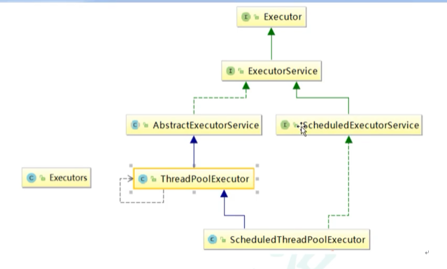
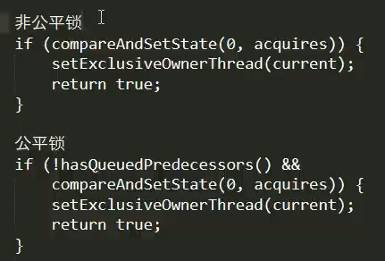

## 一、JUC

### 1.什么是JUC

#### 1.1 进程和线程

+ 进程：系统中正在运行的一个应用程序，进程是资源分配的最小单位
+ 线程：系统分配处理器时间的最小单元，程序执行的最小单位

#### 1.2 线程的状态

+ NEW:新建
+ RUNNABLE：可运行
+ BLOCKED：阻塞状态
+ WAITING：等待状态
+ TIMED_WAITING：等待状态
+ TERMINATED：终止状态

#### 1.3 wait和sleep的区别

+ wait会释放锁，sleep不会释放锁
+ sleep在Thread类种，wait是Object类种的
+ 他们都可以被interrupted方法中断

#### 1.4 并发和并行

+ 串行模式：一个任务一个任务的去执行
+ 并行模式：多个任务一起执行，最后再汇总，例如泡方便面，一遍撕做料带，一边烧水
+ 并发：同一个时刻，多个线程访问同一资源


#### 1.5管程（monitor）

+ 监视器，保证同一资源，在同一时间只有一个线程进行访问
+ java中的锁就是通过管程对象通过对临界区进行加锁，进入临界区加锁，退出解锁

#### 1.6 用户线程和守护线程

+ 用户线程：用户自定义线程
  + 主线程已经结束，用户线程还在运行，jvm存在

```java
public static void main(String[] args) {
    Thread thread = new Thread(() -> {
        System.out.println(Thread.currentThread().getName() + "::" + Thread.currentThread().isDaemon());
        while (true) {

        }
    }, "aa");
    thread.start();
    System.out.println(Thread.currentThread().getName() + ":over");
}
```

+ 守护线程：例如垃圾回收，特殊线程，运行在后台
  + 主线程结束，没有了用户线程，jvm结束运行

```java
thread.setDaemon(true);
thread.start();
System.out.println(Thread.currentThread().getName() + ":over");
```

### 2. 锁接口

#### 2.1 Synchronized

+ 修饰代码块

  ​	作用对象是当前锁定对象，范围是同步语句块范围

+ 修饰方法

  ​	作用对象是调用该方法对象，作用范围是整个方法

+ 修饰静态方法

  ​	作用对象是这个类的所有对象，范围是这个静态方法

+ 修饰一个类

  ​	作用对象是这个类所有对象，范围是Synchronized括号范围


#### 2.2 Lock锁和synchronized有什么区别

+ Lock是一个接口，synchronized是java关键字
+ lock不会自动释放锁，synchronized会自动释放锁
+ lock可以让等待的线程相应终端，而synchronized不行，使用synchronized，线程会一直等待下去，不能沟进行中断

#### 2.3 synchronized 关键字原理

+ synchronized在编译后会被翻译成mo'ni'torenter和monitorexit两条指令分别在代码块的起始和结束为止，
+ 在字节码中monitorexit会出现两次， 代表正常返回和异常处理返回
+ 当monitor为0的时候，线程会将monitor+1代表获取当前锁，
+ 当monitor不为0，判断获取锁的线程是否是当前线程，如果是则monitor+1否则阻塞当前线程

> 阻塞当前线程会涉及到用户态到核心态的切换，会

#### 2.4 synchronized锁升级过程

+ 四种状态，无锁，偏向锁，轻量级锁，重量级锁
+ 锁可以升级，不能降级，但是偏向锁状态可以被重置为无锁

> 升级过程
>
> + 线程获取锁对象，如果是无锁状态，则使用CAS在对象中记录偏向的线程的threadid，
> + 其他线程获取锁的时候，判断当前获取锁的线程是不是自己
>   + 是自己，直接进入，无需使用CAS
>   + 不是自己，判断当前获取锁的线程是否存活，若存活，则代表有锁的竞争，则升级为轻量级锁，若不存货，则使用CAS修改偏向线程ID
> + 轻量级锁
>   + 使用CAS+自旋不断重试获取锁，自旋次数过长后升级为重量级锁
> + 重量级锁
>   + 获取锁的线程会阻塞其他线程，依赖内部的monitor对象实现，monitor依赖底层的操作系统互斥量来实现，需要从用户态转化到核心态，成本非常高。

### 3. 线程间通信

#### 3.1 虚假唤醒

wait在哪里等待，就会在哪里醒，所以要是用

所以要使用while来替代if，循环判断

#### 3.2 线程间的定制化通信

启动三个线程，10轮循环以下

+ AA执行，打印5次
+ BB执行，打印10次
+ CC线程，打印15次

### 4. 线程安全的集合类

#### 4.1 List线程安全解决办法

+ List<String> list = new Vector<>();
+ Collections.synchronizedList(list);
+ CopyOnWriteArrayList ，写时赋值技术
  + 复制、写入、合并、读取新内容

#### 4.2 HashSet线程安全解决办法

+ CopyOnWriteArraySet

#### 4.3 HashMap线程安全解决办法

+ ConcurrentHashMap
+ HashTable

### 5. 死锁

#### 5.1 重现死锁

```java
new Thread(() -> {
    synchronized (a) {
        System.out.println(Thread.currentThread().getName() + "持有锁A，获取锁B");
        synchronized (b) {
            System.out.println(Thread.currentThread().getName() + "获取到锁B");
        }
    }
}, "AA").start();

new Thread(() -> {
    synchronized (b) {
        System.out.println(Thread.currentThread().getName() + "持有锁B，获取锁A");
        synchronized (a) {
            System.out.println(Thread.currentThread().getName() + "获取到锁A");
        }
    }
}, "BB").start();
```

#### 5.2 检测死锁的方法

使用jps找到线程号，使用jstack 线程号 来看堆栈信息

Java stack information for the threads listed above:

"BB":
        at com.lee.juc.deadLock.DeadLock.lambda$main$1(DeadLock.java:22)
        - waiting to lock <0x000000076b0aebf0> (a java.lang.Object)
                - locked <0x000000076b0aec00> (a java.lang.Object)
                at com.lee.juc.deadLock.DeadLock$$Lambda$2/1922154895.run(Unknown Source)
                at java.lang.Thread.run(Thread.java:748)
"AA":
                at com.lee.juc.deadLock.DeadLock.lambda$main$0(DeadLock.java:13)
                - waiting to lock <0x000000076b0aec00> (a java.lang.Object)
                        - locked <0x000000076b0aebf0> (a java.lang.Object)
                        at com.lee.juc.deadLock.DeadLock$$Lambda$1/793589513.run(Unknown Source)
                        at java.lang.Thread.run(Thread.java:748)

Found 1 deadlock.

### 6. Callable接口

#### 6.1 callable和runnable接口的区别

+ callable接口有返回值
+ callable可以跑出异常
+ callable使用call方法，runnable使用run方法

#### 6.2 代码示例

```java
public class CallableDemo implements Callable {
    @Override
    public Integer call() throws Exception {
        System.out.println(Thread.currentThread().getName());
        return 100;
    }

    public static void main(String[] args) throws ExecutionException, InterruptedException {
        CallableDemo callableDemo = new CallableDemo();
        FutureTask<Integer> futureTask = new FutureTask<Integer>(callableDemo);
        new Thread(futureTask, "AA").start();
        Integer integer = futureTask.get();
        System.out.println(integer);
    }
}
```

### 7. JUC辅助类

#### 7.1 CountDownLatch 减少计数

```java
public static void main(String[] args) throws InterruptedException {
    CountDownLatch countDownLatch = new CountDownLatch(6);
    for (int i = 0; i < 6; i++) {
        new Thread(() -> {
            System.out.println(Thread.currentThread().getName() + "走了");
            countDownLatch.countDown();
        }).start();
    }
    countDownLatch.await();
    System.out.println(Thread.currentThread().getName() + "班长锁门了");
}
```

#### 7.2 CyclicBarrier

```java
CyclicBarrier cyclicBarrier = new CyclicBarrier(7, () -> {
    System.out.println(Thread.currentThread().getName() + "找齐七科龙珠，召唤神龙");
});

for (int i = 0; i < 7; i++) {
    new Thread(() -> {
        System.out.println(Thread.currentThread().getName() + "找到龙珠");
        try {
            cyclicBarrier.await();
        } catch (InterruptedException | BrokenBarrierException e) {
            e.printStackTrace();
        }
    }, String.valueOf(i)).start();
}
```

#### 7.3 Semaphore信号灯

```java
// 创建许可
Semaphore semaphore = new Semaphore(3);
for (int i = 0; i < 6; i++) {
    new Thread(() -> {
        try {
            semaphore.acquire();
            System.out.println(Thread.currentThread().getName() + "抢到车位");
            TimeUnit.SECONDS.sleep(new Random().nextInt(5));
            System.out.println(Thread.currentThread().getName() + "离开车位");
        } catch (InterruptedException e) {
            e.printStackTrace();
        } finally {
            semaphore.release();
        }
    }, String.valueOf(i)).start();
}
```

### 8. 读写锁

### 9. 阻塞队列

#### 9.1 阻塞队列概述

+ 当队列是空的时候，从队列中获取元素会阻塞
+ 当队列是满的时候，向队列中放入元素会阻塞

好处：不需要关系什么时候进行阻塞，什么时候需要唤醒

#### 9.2 阻塞队列架构

+ ArrayBlockingQueue 数组结构组成有界队列，获取和添加使用同一个锁，不能同时进行
+ LinkedBlockingQueue链表组成的无界的队列，大小默认值长度为Integer.MAX_VALUE
+ DelayQueue 延迟队列
+ SynchronousQueue单个元素队列
+ PriorityBlockingQueue 优先队列

#### 9.3 核心方法

+ add()，如果队列已经满则跑出异常
+ remove()，如果对列是空的则会抛出异常


+ offer(): 添加成功返回true，队列满添加失败返回false 。
  + 此方法可以设置阻塞时间
+ poll()，队列为空则返回空，不为空则返回元素
  + 此方法可以设置阻塞时间


+ put()，队列满则会阻塞
+ take(), 队列为空则阻塞


### 10. 线程池

#### 10.1 线程池的优点

+ 降低创建销毁线程的资源消耗
+ 提高响应速度，任务到达即可执行，不需要等待创建线程
+ 提高线程的可管理性

#### 10.2 线程池的架构



#### 10.3 线程池的使用

##### 10.3.1 newFixedThreadPool

固定线程数的线程池，超过线程数的线程会被提交到阻塞队列等待

##### 10.3.2 newSingleThreadExecutor

一池一线程，

##### 10.3.3 newCachedThreadPool

线程池数量可以扩容，遇强则强

#### 10.4 线程池的七大参数 ThreadPoolExecutor

+ int corePoolSize
  + 核心线程数量，如果当前线程数未达到这个数，则优先创建新的线程
+ int maximumPoolSize
  + 最大线程数，超过这个数量的线程，会先进入阻塞队列中
+ long keepAliveTime 
  + 超过核心线程数的线程无任务状态存活时间
+ TimeUnit unit
+ BlockingQueue<Runnable> workQueue
  + 阻塞队列
+ ThreadFactory threadFactory
  + 线程创建工厂
+ RejectedExecutionHandler handler
  + 拒绝策略

#### 10.5 四种基本拒绝策略

+ 默认，直接抛出异常
+ 将任务回退到调用者
+ 摒弃队列中等待最久的任务，将当前任务加入到队列中
+ 默默丢弃当前任务，什么也不做

### 11. fork/join分支合并框架

> 可以将一个大的任务拆分，分成多个子任务，并将子任务结果进行合并输出


```java
package com.lee.juc.forkjoin;


import javax.xml.stream.events.ProcessingInstruction;
import java.util.concurrent.ExecutionException;
import java.util.concurrent.ForkJoinPool;
import java.util.concurrent.ForkJoinTask;
import java.util.concurrent.RecursiveTask;

class MyTask extends RecursiveTask<Integer> {

    // 计算10以内的计算
    private static final Integer VALUE = 10;

    // 拆分开始值
    private int begin;
    // 拆分结束值
    private int end;
    // 返回结果
    private int result;

    public MyTask(int begin, int end) {
        this.begin = begin;
        this.end = end;
    }

    @Override
    protected Integer compute() {
        if ((end - begin) < VALUE) {
            for (int i = begin; i <= end; i++) {
                result = result + i;
            }
        } else {
            // 获取数据中间值
            int middle = (begin + end) / 2;
            MyTask taskLeft = new MyTask(begin, middle);
            MyTask taskRight = new MyTask(middle + 1, end);
            taskLeft.fork();
            taskRight.fork();
            result = taskLeft.join() + taskRight.join();
        }
        return result;
    }
}

public class ForkJoinDemo {
    public static void main(String[] args) throws ExecutionException, InterruptedException {
        MyTask myTask = new MyTask(1, 100);
        ForkJoinPool forkJoinPool = new ForkJoinPool();
        ForkJoinTask<Integer> submit = forkJoinPool.submit(myTask);
        Integer integer = submit.get();
        System.out.println(integer);

        // 关闭池对象
        forkJoinPool.shutdown();
    }
}
```

### 12. 异步回调

```java
 CompletableFuture<Integer> completableFuture = CompletableFuture.supplyAsync(() -> {
            System.out.println(Thread.currentThread().getName());
            // 这里可以模拟异常情况，
//            int a = 1 / 0;
            return 1024;
        });
        completableFuture.whenComplete((result, exp) -> {
            System.out.println("result = " + result);
            System.out.println("exp.getMessage() = " + exp.getMessage());
        }).get();
```

## 二、多线程常见问题

### 2.1 线程状态

+ 初始化
+ 就绪start
+ run CPU执行
+ terminate 终止
+ wait  join  等方法会让当前线程等待
+ sleep(s)、wait(s 

### 2.2 守护线程

> 守护线程会随着主线程消亡而消亡

### 2.3 sleep、yied、join、wait、notify

+ sleep释放CPU，进入timeWait状态，不会释放锁
+ yied释放CPU，并且释放锁，让具有相同竞争级别的线程达到尽可能均衡的资源分配
+ join 等待join的线程执行完再指向当前线程
+ wait 当前线程进入wait状态，等待被唤醒
+ notify 唤醒当前wait状态的线程

### 2.4 synconized

锁升级过程

- 升级过程 无锁->偏向锁->轻量级锁（自旋10次）->重量级锁（调用内核了） 无法降级
- 偏向锁默认不开启 需要jvm参数 不开启偏向锁一旦发生竞争就是轻量级锁，偏向锁撤销需要等待safepoint

### 2.5 AQS

#### 2.5.1 加锁

+ 锁标志 位，AQS中state默认值为
  + “0”表示没有线程占用锁
  + “1”表示有现成占有了锁
+ 有线程占有了锁，新现场来抢锁
  + 占有锁的线程是当前线程
    + 重入 state+1，因为释放的时候需要释放对应次数
  + 占有锁的线程不是当前线程（抢锁失败）
  + 如
+ 如果等待区有人，则锁肯定被占用了

#### 2.5.2 释放锁

+ 重入问题
+ 锁状态位(waitStatus)置为0
+ 唤醒队列中等待的线程

#### 2.5.3 入队

+ 是不是第一个节点
  + 是，则进行队列初始化，走for循环，创建两个节点队列，
  + 否，则将node添加到队尾
+ 抢锁
  + 如果新加入的节点是队列中第二个节点，则进行抢锁（很有可能之前占有锁的线程已经释放锁了）
    + 抢到
    + 未抢到：阻塞

#### 2.5.4 出队

#### 2.5.5 阻塞

#### 2.5.6 唤醒

#### 2.5.7 公平锁和非公平锁的本质区别，

> 当一个新的线程进来的时候，正好有线程释放锁，新线程是直接参与锁竞争还是去队列末尾等待



#### 2.5.8 AQS队列和普通队列的差别

+ AQS队列中的第一个节点是占有锁的线程对应的节点

### 2.6 Exchanger

### 2.7 Automic原子类

#### 2.7.1 偏移量

> 通过传递的档期对象this可以找到对象在内存中的起始位置，在通过偏移量可以找到对应的属性
>
> 也就是说要想修改某个对象中的某个属性的值，必须知道这个属性的在这个对象中的偏移量

#### 2.7.2 底层实现原理

> atomic基于无锁算法cas，使用Unsafe的三大api compareAndSwapObject、compareAndSwapInt、
>
> compareAndSwapObject、compareAndSwapLong

这些底层API的实现依赖于操作系统硬件原语 **CMPXCHG**实现的CAS操作，这个操作不需要切换到核心态，在用户态就可以执行

#### 2.7.3 修改一个数组

```
AtomicIntegerArray
```

#### 2.7.4 修改一个对象中的属性

```java
@Test
public void test(){
    AtomicIntegerFieldUpdater<Student> id = AtomicIntegerFieldUpdater.newUpdater(Student.class, "old");
    Student student = new Student(1, 25);
    id.getAndIncrement(student);
    System.out.println(id.get(student));
}


class Student {
    private Integer id;
    // 该属性必须是public且是volite修饰的
    public volatile int old;

    public Student(Integer id, int old) {
        this.id = id;
        this.old = old;
    }
}


// 对于其他类型的可以使用AtomicRefrenceFieldUpdater
```

#### 2.7.5 ABA问题

现象：

A线程在修改一个变量的中间其他线程修改了该变量，但是值还是原来的值，A线程仍然无感知，直接修改

如何解决：

增加版本号，类似于数据库的丢失更新问题，atomic类已经有实现了对应的版本号的CAS

> ```java
> AtomicStampedReference stampedReference = new AtomicStampedReference(user,0);
> ```

#### 2.7.6 Unsafe魔术类，直接操作内存

> 该类在sun.misc包下，拥有执行低级别不安全操作的API，可以直接访问系统内存资源，Unsafe是单里的，提供静态方法getUnsafe来获取一个Unsafe对象，只有引导类加载器才能调用getUnsafe方法

```java
Field f = Unsafe.class.getDeclaredField("theUnsafe");
f.setAccessible(true);
Unsafe unsafe = (Unsafe) f.get(null);

long memoryAddress = unsafe.allocateMemory(8);
System.out.println("memoryAddress = " + memoryAddress);
// 写入内存
unsafe.putAddress(memoryAddress, 12321312321L);

long addressValue = unsafe.getAddress(memoryAddress);
System.out.println("addressValue = " + addressValue);
```

### 2.8 ReentrantLock源码

**公平锁：**

```java
// 该方法会竞争锁，如果竞争不到会将当前线程阻塞并且入队
final void lock() {
    acquire(1);
}

public final void acquire(int arg) {
        if (!tryAcquire(arg) &&
            acquireQueued(addWaiter(Node.EXCLUSIVE), arg))
            selfInterrupt();
    // tryAcquire(arg) 尝试获取锁，
    // addWaiter(Node.EXCLUSIVE) 如果未获取锁，创建一个Node节点(当前线程，共享模式)入队，并返回入队的节点
    //  acquireQueued(node).
}


// 尝试获取锁
protected final boolean tryAcquire(int acquires) {
            final Thread current = Thread.currentThread();
            int c = getState();
            if (c == 0) {
                // 这里c==0表示当前锁没有人持有，
                // 公平锁需要判断队列中是否有元素，如果有元素，则不能进行锁竞争
                if (!hasQueuedPredecessors() &&
                    compareAndSetState(0, acquires)) {
                    setExclusiveOwnerThread(current);
                    return true;
                }
            }
            else if (current == getExclusiveOwnerThread()) {
                // 这里判断是不是锁重入，state不为0的时候如果当前独占锁的线程是自己，则可以重入
                // 这里不会出现锁的竞争问题，
                int nextc = c + acquires;
                if (nextc < 0)
                    throw new Error("Maximum lock count exceeded");
                setState(nextc);
                return true;
            }
            return false;
}

// 获取锁失败的线程入队
// 当前方法返回入队后的节点
private Node addWaiter(Node mode) {
    Node node = new Node(Thread.currentThread(), mode);
    // Try the fast path of enq; backup to full enq on failure
    Node pred = tail;
    // 这里这个判断如果之前队列没有被初始化则不会执行
    // TODO 是干嘛的呢？
    if (pred != null) {
        node.prev = pred;
        if (compareAndSetTail(pred, node)) {
            pred.next = node;
            return node;
        }
    }
    // 这里是创建队列并将当前的node放到队尾
    enq(node);
    return node;
}

// 如果队列没有被初始化，则创建一个空节点，头尾都指向ta，
// 如果已经被初始化了，使用CAS来设置尾节点为当前节点，直到设置成功，
    private Node enq(final Node node) {
        for (;;) {
            Node t = tail;
            if (t == null) { // Must initialize
                if (compareAndSetHead(new Node()))
                    tail = head;
            } else {
                node.prev = t;
                if (compareAndSetTail(t, node)) {
                    t.next = node;
                    return t;
                }
            }
        }
    }


// 此方法在未获取到锁线程入队后执行，如果档期那线程的pre是头结点（dummy的）用于再次让这个线程获取锁，避免线程中断，
    final boolean acquireQueued(final Node node, int arg) {
        boolean failed = true; // 是否需要阻塞
        try {
            boolean interrupted = false;
            for (;;) {
                final Node p = node.predecessor();
                if (p == head && tryAcquire(arg)) {
                    // 这里非常重要！！！！
                    // 如果当前节点头pre是头结点，再次尝试获取锁，如果获取到，说明头结点为虚拟节点或者
                    // 头结点已经释放掉锁，咋将头结点指向当前节点
                    setHead(node);
                    p.next = null; // help GC
                    failed = false;
                    return interrupted;
                }
                if (shouldParkAfterFailedAcquire(p, node) &&
                    parkAndCheckInterrupt())
                    interrupted = true;
            }
        } finally {
            if (failed)
                cancelAcquire(node);
        }
    }

```