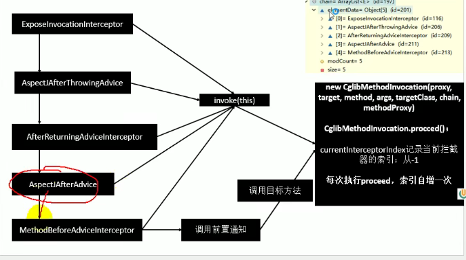

# Spring

## IOC

### 容器启动实现类

+ ClassPathXmlApplicationContext
+ FileSystemXmlApplicationContext
+ AnnotationConfigApplicationContext

### 给容器注册组件的方式

+ 包扫描+组件标注注解（@Controller/@Service/@Repository/@Component）[自己写的类]

+ @Bean[导入的第三方包里面的组件]

+ @Import[快速给容器中导入一个组件]

  + ```java
    // 使用Import注解
    @Import({Color.class, MyImportSelector.class, MyImportBeanDefinitionRegistrar.class})
    
    // 实现ImportSelector
    public class MyImportSelector implements ImportSelector {
    
    
        public String[] selectImports(AnnotationMetadata annotationMetadata) {
            return new String[]{"com.lee.component.Blue"};
        }
    }
    
    // 实现了ImportBeanDefinitionRegistrar接口的实现
    public class MyImportBeanDefinitionRegistrar implements ImportBeanDefinitionRegistrar {
        public void registerBeanDefinitions(AnnotationMetadata importingClassMetadata, BeanDefinitionRegistry registry, BeanNameGenerator importBeanNameGenerator) {
                final RootBeanDefinition rootBeanDefinition = new RootBeanDefinition(RainBow.class);
                registry.registerBeanDefinition("rainBow", rootBeanDefinition);
        }
    }
    
    ```


+ 使用Spring提供的 FactoryBean（工厂Bean）

  ```java
  public class ColorFactory  implements FactoryBean<Color> {
      public Color getObject() throws Exception {
          return new Color();
      }
      public Class<?> getObjectType() {
          return Color.class;
      }
      public boolean isSingleton() {
          return true;
      }
  }
  ```

  

### 使用@ComponentScan

+ value值表示要扫描的包
+ 可以使用仅包含（useDefaultFilters = false），或者排除某些组件
+ FilterType.ANNOTATION：按照注解
+ FilterType.ASSIGNABLE_TYPE：按照给定的类型；
+ FilterType.ASPECTJ：使用ASPECTJ表达式
+ FilterType.REGEX：使用正则指定
+ FilterType.CUSTOM：使用自定义规则
  + 使用自定义匹配规则的话需要一个实现了TypeFilter接口的方法


### 使用@Bean

+ Bean的生命周期：bean创建---初始化----销毁的过程
+ 容器管理生命周期：

  + 创建对象

    + 单实例：在容器启动的时候创建对象，

    + 多实例：在每次获取的时候创建对象，容器不会管理这个bean；容器不会调用销毁方法；
  + BeanPostProcessor.postProcessBeforeInitialization前置处理器
  + 遍历得到容器中所有的BeanPostProcessor；挨个执行beforeInitialization，一但返回null，跳出for循环，不会执行后面的BeanPostProcessor.postProcessorsBeforeInitialization
  + 初始化

    + 对象创建完成，并赋值好，调用初始化方法。。。
  + BeanPostProcessor.postProcessAfterInitialization后置处理器
  + 销毁

    + 单实例：容器关闭的时候
    + 多实例：容器不会管理这个bean；容器不会调用销毁方法
+ 指定初始化和销毁方法的方式
  + 通过@Bean指定init-method和destroy-method；
  + 通过让Bean实现InitializingBean（定义初始化逻辑），DisposableBean（定义销毁逻辑）
  + 可以使用JSR250
    + @PostConstruct：在bean创建完成并且属性赋值完成；来执行初始化方法
    + @PreDestroy：在容器销毁bean之前通知我们进行清理工作
  + BeanPostProcessor【interface】：bean的后置处理器；
    + postProcessBeforeInitialization:在初始化之前工作
    + postProcessAfterInitialization:在初始化之后工作
+ 初始化先后顺序
  + 调用Car的构造构造方法
  + postProcessBeforeInitialization=====>car
  + 调用@PostConstruct标注的初始化方法
  + 调用InitializingBean的afterPropertiesSet
  + postProcessAfterInitialization=====>car
  + 调用@PreDestroy标注的销毁方法
  + 调用DisposableBean接口的destroy


### @Profile

+ 指定组件在哪个环境的情况下才能被注册到容器中，不指定，任何环境下都能注册这个组件
  + 加了环境标识的bean，只有这个环境被激活的时候才能注册到容器中。默认是default环境
  + 写在配置类上，只有是指定的环境的时候，整个配置类里面的所有配置才能开始生效
  + 没有标注环境标识的bean在，任何环境下都是加载的

### @Conditional

+ ```java
  @Conditional(value = WindowsCondition.class)
  ```

+ 验证类种返回的方法返回true当前组件才会被扫描

### @PropertySource

+ @PropertySource(value={"classpath:/person.properties"})
+ 使用@PropertySource读取外部配置文件中的k/v保存到运行的环境变量中;加载完外部的配置文件以后使用${}取出配置文件的

### 组件赋值和自动装配

#### @AutoWired

+ 先找类型，再找名字，如果存在相同名字的，需要使用@Primary指定优先加载的
+ @Qualifier配合@AutoWired可以指定bean的名字
+ 作用在不通地方得不同作用
  + 作用在方法，方法参数从容器中获取，默认也是这样的，所以可以不加
  + 作用在构造器上，通过容器过去参数
  + 作用在参数上

#### Java规范的自动装配

+ @Resource:默认是按照组件名称进行装配的；不支持@Primary，required=false
+ @Inject:需要导入javax.inject的包 ，不支持required=false

#### 通过实现xxxArea在方法参数中自动装配

## AOP

### 什么是AOP

+ 指在程序运行期间动态的将某段代码切入到指定方法指定位置进行运行的编程方式

### 如何实现

+ 将业务逻辑组件和切面类都加入到容器中；告诉Spring哪个是切面类（@Aspect）
+ 在切面类上的每一个通知方法上标注通知注解，告诉Spring何时何地运行（切入点表达式）
+ 开启基于注解的aop模式；@EnableAspectJAutoProxy
+ 如何在切点获取参数和返回值
  + 自动注入JoinPoint参数，可以获得参数和返回值

```java
@Aspect
public class LogAspects {
    @Pointcut("execution(* com.lee.aop.Calculator.*(..))")
    public void pointCut() {
    }
    @Before("pointCut()")
    public void startMethod(JoinPoint joinPoint) {
        System.out.println("方法" + joinPoint.getSignature().getName() + Arrays.asList(joinPoint.getArgs()) + "开始");
    }
    @After("pointCut()")
    public void endMethod(JoinPoint joinPoint) {
        System.out.println("方法" + joinPoint.getSignature().getName() + Arrays.asList(joinPoint.getArgs()) + "结束");
    }
    @AfterReturning(value = "pointCut()", returning = "result")
    public void returnMethod(JoinPoint joinPoint, Object result) {
        System.out.println("方法" + joinPoint.getSignature().getName() + Arrays.asList(joinPoint.getArgs()) + "返回值为" + result);
    }
    @AfterThrowing(value = "pointCut()", throwing = "exception")
    public void exceptionMethod(JoinPoint joinPoint, Exception exception) {
        System.out.println("方法" + joinPoint.getSignature().getName() + Arrays.asList(joinPoint.getArgs()) + "异常");
    }
}
```

### AOP的原理

##### 1. 导入自动代理创建器组件

+ 顶层注解@EnableAspectJAutoProxy使用@import注解导入AspectJAutoProxyRegistrar.class
+ AspectJAutoProxyRegistrar实现了ImportBeanDefinitionRegistrar
+ 在这个方法中注册了一个AnnotationAwareAspectJAutoProxyCreator组件

##### 2. 两个回调方法

+ 这个自动代理创建器层层继承，顶层类AbstractAutoProxyCreator实现了SmartInstantiationAwareBeanPostProcessor, BeanFactoryAware接口，

+ SmartInstantiationAwareBeanPostProcessor接口作为一个beanPostPorcessor，有四个回调方法

  比较重要的有

  + ```java
    // 此方法在创建bean对象之前调用
    postProcessBeforeInstantiation
        
    // 判断档期那bean是否已经在advisedBeans中，advisedBeans保存了所有需要增强（被代理）的bean
    // 判断bean是否是切面，是否实现了Adivce、Pointcut、Advisor或者标注了@Aspect注解
    // 判断是否实现了TargetSourceCreator接口，如果实现该接口则在此就创建代理
    // 允许在bean初始化前创建代理
    ```

  + ```java
    // 此方法在bean初始化之后调用
    postProcessAfterInitialization
    
    // 查找所有的advicer增强器，从中找到当前bean可以用的
    // 对增强器集合进行排序
    // 创建代理对象（如果实现了接口，则使用jdk否则使用cglib）
    // 给容器中直接返回增强过的代理对象
    // 代理对象会封装所有的增强器
    ```

##### 3. 目标方法的执行

 代理对象保存了所有增强器

+ 获取将要执行的目标方法拦截器链

  + 遍历所有增强器，转化为Inteceptor数组(MethodInterceptor)

+ 如果拦截器链为空，则直接调用目标对象的invoke方法

+ 如果有拦截器链，把目标对象、目标方法、拦截器链封装成一个CglibMethodInvocation，然后调用他的proceed方法

  + 通过currentInterceptorIndex=-1来记录当前拦截器的索引，如果currentInterceptorIndex=数组大小-1则表示没有拦截器，或者已经执行到最后一个拦截器

    


使用类似上面的链式执行来控制通知方法的执行

正常执行：前置-后置-返回

异常执行：前置-后置-异常


## 声明式事务

### 1. 使用

+ 使用@EnableTransactionManagement开启事务

+ 配置数据源

+ 注入事务管理器

+ 使用@Transactional注解

+ ```java
  // 事务管理器顶层都是PlatformTransactionManager接口，我们常用的就是DataSourceTransactionManager实现
  @Bean
  PlatformTransactionManager transactionManager(@Autowired DataSource dataSource){
      return new DataSourceTransactionManager(dataSource);
  }
  ```

### 2. 原理

+ @EnableTransactionManagement注解中@import注解导入两个组件
+ 组件1：AutoProxyRegistrar.class
  + 利用后置处理器，拦截目标对象，返回一个代理对象，封装了拦截器链

+ 组件2：ProxyTransactionManagementConfiguration.class
  	+  拿到事务注解的信息，
   +  拦截器
      	+  获取事务相关属性，获取事务管理器
       +  执行目标方法
          	+  异常，回滚事务
             	+  非异常，提交事务


## 几种beanPostPorcessor的加载时机

### BeanFactoryPostProcessor

beanfactory创建完成之后，可以修改bean的定义信息

### BeanDefinitionRegistryPostProcessor

bean定义被加载，之后修改bean定义信息

## 事件监听（事件驱动模型）

### 1. 使用

+ 写一个监听器，监听ApplicationEvent下面的事件

+ 把监听器放到容器中

+ 只有有相关类型的时间发送则会监听到这个事件，常用事件

  + finishRefresh方法中，发布ContextRefreshEvent
  + 容器关闭，发布ContextCloseEvent

+ 发布事件

  + ```java
    ApplicationEvent applicationEvent = new ApplicationEvent("我发布了事件"){};
    context.publishEvent(applicationEvent);
    ```

### 2. 原理

+ 获取事件多播器

+ ```
  // 获取当前事件所有子集的事件，可以多线程异步的执行，回调时间监听器中的onApplicationEvent方法
  getApplicationEventMulticaster().multicastEvent(applicationEvent, eventType)
  
  ;
  ```

+ 事件多播器初始化

  + 如果容器中注册了组件，就用容器中的，如果没有，就创建一个默认的
  + 注册监听器，拿到所有监听器（type为applicationevent类型的），放入到多播器中

### 3. 通过@eventListener实现监听器

```java
@EventListener(classes = ApplicationEvent.class)
    public void listen(ApplicationEvent applicationEvent) {
        System.out.println("使用注解完成事件" + applicationEvent.toString());
    }
}
```

#### 原理

通过EventListenerMethodProcessor后置处理器来完成，实现了SmartInitializingSingleton这个借口

这个借口回调方法会在所有单实例bean创建完成后调用


## IOC启动原理

### 1、prepareRefresh()刷新前的预处理工作

+ 记录开始时间和设置容器状态

+ ```java
  initPropertySources(); // 初始化一些属性设置;子类自定义个性化的属性设置方法；
  ```

+ ```java
  getEnvironment().validateRequiredProperties(); // 检验属性的合法等
  ```

+ ```java
  this.earlyApplicationListeners = new LinkedHashSet<>(this.applicationListeners);
  // 保留容器一些早期的事件
  ```

### obtainFreshBeanFactory()获取BeanFactory

+ ```java
  refreshBeanFactory();
  // 创建BeanFactory，并设置一个序列化ID
  ```

+ ```java
  ConfigurableListableBeanFactoryreturn getBeanFactory();  
  // 返回当前BeanFactory，类型为ConfigurableListableBeanFactory
  ```


### prepareBeanFactory(beanFactory)

>  BeanFactory的预准备工作对,对BeanFactory进行一些设置

+ 设置BeanFactory的类加载器、支持表达式解析器..

+ 添加一个BeanPostProcessor

  ```java
  beanFactory.addBeanPostProcessor(new ApplicationContextAwareProcessor(this));
  // 当前
  ```

+ 设置忽略自动装配的接口

+ 设置可以解析自动装配的接口

  > BeanFactory、ResourceLoader、ApplicationEventPublisher、ApplicationContext
  >
  > 这些对象可以在任意组件中实现自动转配

+ 添加BeanPostProcessor

  ```java
  beanFactory.addBeanPostProcessor(new ApplicationListenerDetector(this));
  ```

+ 给BeanFactory中注册了一些能用的组件

  + environment【ConfigurableEnvironment】、
  + systemProperties【Map<String, Object>】、
  + systemEnvironment【Map<String, Object>】


### postProcessBeanFactory(beanFactory)

> 一个保护方法，子类通过重写此方法可以实现一些beanFactory准备完成后的一些设置工作


### invokeBeanFactoryPostProcessors(beanFactory)

> 执行两个接口的方法BeanFactoryPostProcessor、BeanDefinitionRegistryPostProcessor

+ 先执行BeanDefinitionRegistryPostProcessors的方法
  + 获取所有的BeanDefinitionRegistryPostProcessor；
  + 看先执行实现了PriorityOrdered优先级接口的BeanDefinitionRegistryPostProcessors
  + 在执行实现了Ordered顺序接口的BeanDefinitionRegistryPostProcessors
  + 最后执行没有实现任何优先级或者是顺序接口的BeanDefinitionRegistryPostProcessors
+ 在执行BeanFactoryPostProcessor的方法
  + 获取所有的BeanFactoryPostProcessor
  + 看先执行实现了PriorityOrdered优先级接口的BeanFactoryPostProcessor、
  + 在执行实现了Ordered顺序接口的BeanFactoryPostProcessor；
  + 最后执行没有实现任何优先级或者是顺序接口的BeanFactoryPostProcessor；


### registerBeanPostProcessors(beanFactory)注册Bean的后置处理器

> 注册bean的后置处理器（拦截bean的创建过程）
>
> 不同的BeanPostProcessor在Bean创建前后的执行时机是不一样的

+ 获取所有的BeanPostProcessor（后置处理器都有有优先级，可以通过实现PriorityOrdered，活着的ordered

  接口来实现优先级）

+ 先注册PriorityOrdered接口的BeanPostProcessor（将BeanPostProcessor加到BeanFactory中去）

+ 再注册Ordered接口的

+ 最后再注册没有实现任何接口的

+ 最终注册MergedBeanDefinitionPostProcessor类型的BeanPostProcessor

+ 注册一个ApplicationListenerDetector  用于在bean创建完成后检查是不是applicationListener，如果是将这个bean添加到容器中的applicationListener

### initMessageSource()初始化MessageSource组件

> 国际化功能，消息绑定，消息解析

+ 获取BeanFactory
+ 判断容器中是不是有MessageResouce的组件，如果有则赋值给messageSource属性，如果没有自己创建一个默认的
+ 将组件注册到容器中。以后获取的时候可以自动注入MessageSource，调用他的getMessage()

### initApplicationEventMulticaster()初始化时间派发器

+ 获取BeanFactory
+ 从BeanFactory中获取applicationEventMulticaster的ApplicationEventMulticaster
+ 如果上一步没有配置；创建一个SimpleApplicationEventMulticaster
+ 将创建的事件派发器，添加刀BeanFactory中，以后在其他组件自动注入


### onRefresh()

> 空方法，子类重写这个方法，在容器刷新的时候可以自定义刷新容器方法

### registerListeners()

> 注册所有项目中的ApplicationListener

+ 从容器中拿到所有的ApplicationListener

+ 将每个监听器添加到事件派发器中；

  ```java
  getApplicationEventMulticaster().addApplicationListenerBean(listenerBeanName);
  ```

+ 派发之前步骤产生的事件


### finishBeanFactoryInitialization(beanFactory)

> 初始化剩下的所有单例bean（Bean的初始化过程）

+ beanFactory.preInstantiateSingletons();
  + 获取容器中的所有Bean，依次初始化和创建对象
  + 获取Bean的定义信息
  + 判断Bean是单例、不是抽象、不是懒加载的
    + 在判断是不是工厂Bean，如果是工厂Bean，使用工厂方法创建Bean；如果不是通过getBean(beanName)来创建对象
+ getBean的步骤
  + 调用doGetBean(beanName)
    + 先从缓存中获取bean，如果能获取到，则表示档期那bean已经被创建过了，
    + 缓存中获取不到，则创建对象
    + 标记当前Bean已经被创建
    + 获取Bean的定义信息，
    + 获取当前bean所依赖的其他Bean，如果有则按照GetBean的方式获取
    + 


## servlet启动

### springmvc启动

servlet容器启动会扫描所有的jar包找serveltContainerInitializer的实现类，会调用实现类中的启动方法

回调onstartup方法，在onstartup方法内可以注册组件

```java
void onStartup(Set<Class<?>> c, ServletContext ctx) throws ServletException;
// 第一个参数可以通过@HandlesType 将我们需要的类传递进来
// 第二个参数
```

通过@HandlesType注解可以实现将我们需要的类及其子类，传递到onstartup方法

spring启动使用SpringServletContainerInitializer，在这个回调方法里面创建一个WebApplicationContext对象

初始化dispatchservlet

将dispatchservlet添加到servletcontext

## springboot的启动流程

### 1. 核心注解

@SpringBootApplication注解包含了

+ @SpringBootConfiguration
+ @EnableAutoConfiguration
+ @ComponentScan

### @EnableAutoConfiguration

+ @AutoConfigurationPackage
  + 将主类所在包下面的组件都添加进去

+ 加载自动配置类@AutoConfigurationImportSelector
  + 这个注解实现了ImportSelector接口，可以返回一个数组，表示要导入的组件
    + 内部会加载spring.factories类里面的所有配置类（xxxAutoConfiguration）
+ 按需开启，ConditionOnxxxxxx
+ 每个配置类一半都会绑定xxxxproperties，对应spring配置我呢间里面的spring.xxxx.xxxx
