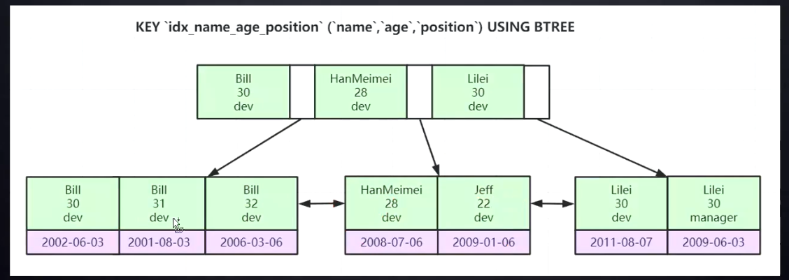
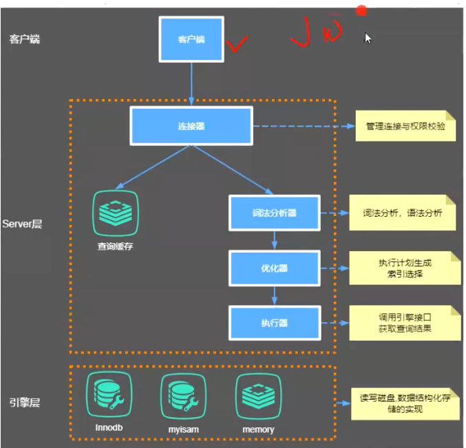
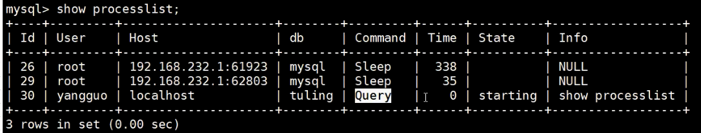
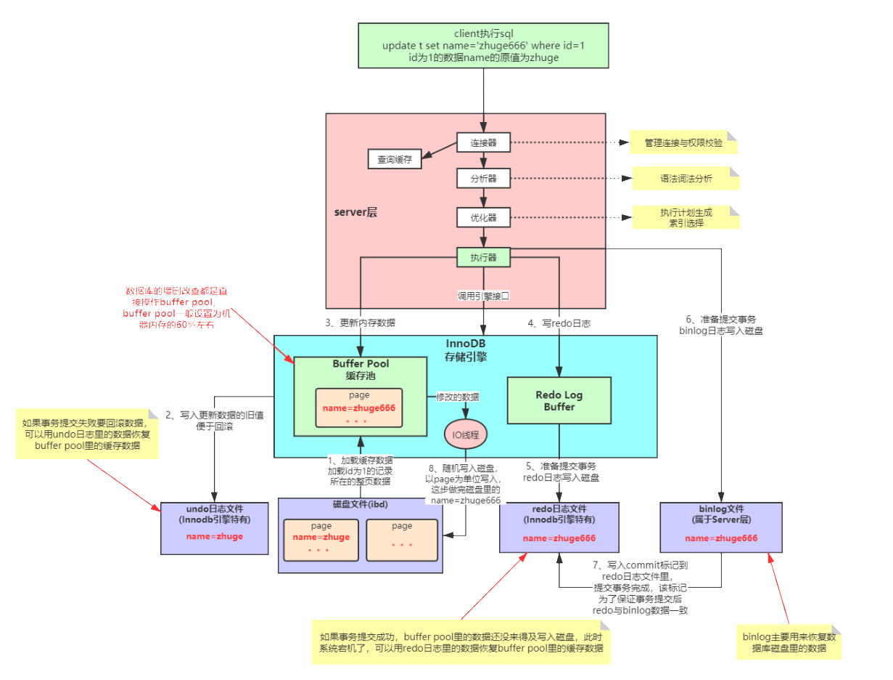
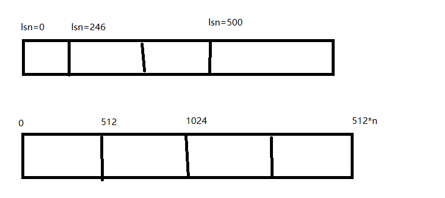

# 图灵听课笔记

## 一、MYSQL

### 1.1 聚集索引与非聚集索引

聚集索引叶子节点存储所有数据，无需回表

### 1.2 为什么要建立一个自增的整型主键

+ 如果未指定主键，数据库会寻找一个数据都不相同的列来创建索引，否则创建一个隐藏的自增列

+ 整形相对字符串占用更小的空间，
+ 避免page split问题

### hash索引的弊端

+ 查找等值速度快，无法进行范围查询

### innodb的非主键索引，为什么叶子节点存储主键id？

+ 叶子节点存储的不是数据，而是主键id
  + 减少插入数据索引维护的复杂度
  + 减少磁盘空间占用

### 联合索引，为什么要最左前缀原则

> 多个字段共同组织成一个索引

+ 索引创建的时候会按照指定的列顺序将数据排好序，先按照name排序，再按照age

+ 如果不先使用name搜索，则age实际是无序的（只有在name相等的情况下，age才是排好序的）

  这就是为什么说索引是排好序的数据结构

### EXPLAIN语句

+ id：sql执行的顺序

+ select_type：表示对应行是简单还是复杂的查询。

  + simple：简单查询不包含子查询和union
  + primary：复杂查询最外层
  + subquery：子查询
  + derived：from子句的子查询

+ table：表名

+ **type：访问类型：**

  > system > const > eq_ref > ref > range > index > ALL

  + eq_ref：使用唯一索引
  + ref：使用索引查找不唯一
  + index：使用索引全表扫描，通常扫描二级索引，这种情况通常使用覆盖索引优化
  + all：全表扫描

+ possible_keys：可能用到的索引

+ key：用到的索引

+ key_len：mysql索引中使用的字节数，通过这个字段可以判断真正使用了多少索引

+ rows：表示要读取并检测的行数

+ extra: 这一列展示的是额外信息。常见的重要值如下：

  + Using index：使用覆盖索引,要查询的字段都在辅助索引内，不需要回表
  + Using filesort：将用外部排序而不是索引排序，数据较小时从内存排序，否则需要在磁盘完成排序。这种情况下一 般也是要考虑使用索引来优化的。
  + 

### MYSQL架构

### 问题排查语句

+ 查看当前执行的线程

> SHOW PROCESSLIST;

### 索引优化

+ 1、MySQL支持两种方式的排序filesort和index，Using index是指MySQL扫描索引本身完成排序。index 效率高，filesort效率低。 

+ 2、order by满足两种情况会使用Using index。 
  + 1) order by语句使用索引最左前列。
  + 2) 使用where子句与order by子句条件列组合满足索引最左前列。

+ 3、尽量在索引列上完成排序，遵循索引建立（索引创建的顺序）时的最左前缀法则。 
+ 4、如果order by的条件不在索引列上，就会产生Using filesort。 
+ 5、能用覆盖索引尽量用覆盖索引 
+ 6、group by与order by很类似，其实质是先排序后分组，遵照索引创建顺序的最左前缀法则。对于group by的优化如果不需要排序的可以加上order by null禁止排序。注意，where高于having，能写在where中 的限定条件就不要去having限定了。

### MYSQL排序方式

+ filesort文件排序方式
  + 单路排序
    + 是一次性取出满足条件行的所有字段，然后在sort buffer中进行排序
  + 双路排序（回表排序）
    + 是一次性取出满足条件行的所有字段，然后在sort buffer中进行排序
+ using  index

### 表关联的两种算法

如果关联字段有索引，mysql会使用**嵌套循环连接 Nested-Loop Join(NLJ) 算法**

+ 通过where条件查找到驱动表中的所有数据，
+ 在一条一条的通过索引去查询被驱动表的索引数据，相当用户扫描了2N（小驱动表）次数

如果关联字段没有索引，NLJ算法下路会比较低下，则mysql会使用**块级嵌套循环连接 BLOCK Nested-Loop Join(BNLJ) 算法**

+ 将驱动表中的数据读取到joinbuffer中，把被驱动表中的每一条数据拿出来作比对。扫描次数为M*N的次数

### Innodb引擎SQL执行的BufferPool缓存机制

### RedoLog

write-ahead，表示真正去写磁盘的时候会将redolog先写入，redolog的落盘也是异步的

#### redolog落盘策略

+ 0：每秒刷一次盘
+ 1：每提交一个事务刷一次盘
+ 2：不刷盘，根据innodb_flush_log_at_timeout（master线程刷写日志的频率）的值来决定刷盘频率

#### redolog的文件结构

>  逻辑结构和物理结构

> lsn是从数据库安装开始就记录的当前总的日志字节数，通过lsn可以定位到block，通过block也可以定外地到lsn

>lsn是从数据库安装开始就记录的当前总的日志字节数，通过lsn可以定位到block，通过block也可以定外地到lsn

