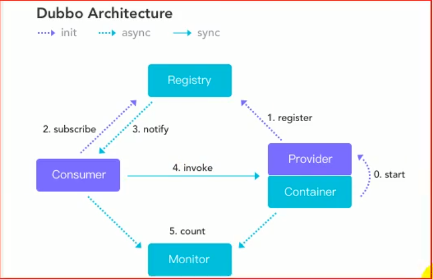

###  dubbo学习

### 1.1.1 基本概念

#### 1.1.1.1 dubbo调用执行速度两个决定性因素

+ 网络传输
+ 序列化与反序列化速度

#### 1.1.1.2 dubbo的特性（好处）

+ 面向接口代理开发，类似于mybatis的mapper层我们只需要写一个接口的实现就可以了
+ 智能负载均衡
+ 服务自动注册与发现
+ 高度可扩展，基于微内核+插件的设计原则
+ 运行期流量调度，内置条件脚本等路由策略，通过配置路由，实现灰度发布
+ 可视化的服务治理与运维

#### 1.1.1.3 dubbo的调用过程

+ 0、1、2启动的时候进行
+ 3、5 为一个异步的过程
+ 4是同步

#### 1.1.1.4 dubbo配置的优先级

- 方法级优先，接口级次之，全局配置再次之。
- 如果级别一样，则消费方优先，提供方次之。

#### 1.1.1.5 重试次数

+ 调用超时后，服务重试的次数
+ 当有多个服务提供的时候，会轮训调用，
+ 对于幂等接口（调用结果和调用次数无关，（查询、删除、修改））可以设置重试
+ 对于非幂等（调用结果会受到调用次数影响（新增）） 不能设置重试次数

#### 1.1.1.4 多版本

+ 使用版本号，可以对同一个接口进行版本区分，从而进行灰度发布

### 1.1.2 高可用

#### 1.1.2.1 注册中心宕机

+ 注册中心宕机后也是可以进行通讯的， 因为有本地缓存
+ 不适用注册中心，可以使用直连的方式进行dubbo的调用

#### 1.1.2.2 dubbo的负载均衡策略

+ 基于权重的负载均衡策略（默认）
+ 基于权重的轮训负载均衡策略
+ 最少活跃数（上次调用相应速度最快的）
+ 一致性hash

