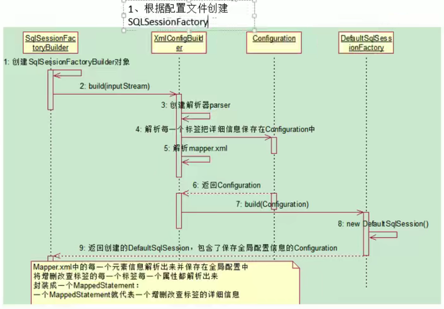
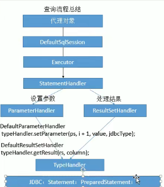

# mybatis

## 一、配置和使用

## 二、源码分析

### 2.1 创建SqlSessionFactory对象（封装了Configration对象）

```java
InputStream inputStream = Resources.getResourceAsStream("mybatis-config.xml");
SqlSessionFactory sqlSessionFactory = new SqlSessionFactoryBuilder().build(inputStream);
```



+ 传入配置文件输入流，通过DOM+Xpath进行解析

```java
// mybatis中都是使用这个类进行解析的，这个类封装了Cofiguration对象和Xpather对象，使用xpath进行解析，
public class XMLMapperBuilder extends BaseBuilder {

  private final XPathParser parser;
  private final MapperBuilderAssistant builderAssistant;
  private final Map<String, XNode> sqlFragments;
  private final String resource;
}

public abstract class BaseBuilder {
  protected final Configuration configuration;
  protected final TypeAliasRegistry typeAliasRegistry;
  protected final TypeHandlerRegistry typeHandlerRegistry;
}
```

```java
propertiesElement(root.evalNode("properties"));
Properties settings = settingsAsProperties(root.evalNode("settings"));
loadCustomVfs(settings);
loadCustomLogImpl(settings);
typeAliasesElement(root.evalNode("typeAliases"));
pluginElement(root.evalNode("plugins"));
objectFactoryElement(root.evalNode("objectFactory"));
objectWrapperFactoryElement(root.evalNode("objectWrapperFactory"));
reflectorFactoryElement(root.evalNode("reflectorFactory"));
settingsElement(settings);
// read it after objectFactory and objectWrapperFactory issue #631
environmentsElement(root.evalNode("environments"));
databaseIdProviderElement(root.evalNode("databaseIdProvider"));
typeHandlerElement(root.evalNode("typeHandlers"));
mapperElement(root.evalNode("mappers"));
```

```java
// 解析maapers配置
mapperElement(root.evalNode("mappers"));

// 调用addMapper方法
configuration.addMappers(mapperPackage);

// addMapper方法会创建，创建一个MapperProxyFactory封装到knownMappers中去
// 解析对应的sqlMapper文件，
public <T> void addMapper(Class<T> type) {
    if (type.isInterface()) {
      boolean loadCompleted = false;
      try {
        knownMappers.put(type, new MapperProxyFactory<>(type));
        // It's important that the type is added before the parser is run
        // otherwise the binding may automatically be attempted by the
        // mapper parser. If the type is already known, it won't try.
        MapperAnnotationBuilder parser = new MapperAnnotationBuilder(config, type);
        parser.parse();
        loadCompleted = true;
      } finally {
        if (!loadCompleted) {
          knownMappers.remove(type);
        }
      }
    }
  }

// 解析SQLmapper会处理对应的标签，保存所有标签的信息
public void parse() {
    if (!configuration.isResourceLoaded(resource)) {
      configurationElement(parser.evalNode("/mapper"));
      configuration.addLoadedResource(resource);
      bindMapperForNamespace();
    }
    
    parsePendingResultMaps();
    parsePendingCacheRefs();
    parsePendingStatements();
  }

```


### 2.2 通过SqlSessionFactory创建SqlSession

```java
private SqlSession openSessionFromDataSource(ExecutorType execType, TransactionIsolationLevel level, boolean autoCommit) {
  Transaction tx = null;
  try {
    final Environment environment = configuration.getEnvironment();
    final TransactionFactory transactionFactory = getTransactionFactoryFromEnvironment(environment);
     // 开启一个事务
    tx = transactionFactory.newTransaction(environment.getDataSource(), level, autoCommit);
      // 创建Executer
    final Executor executor = configuration.newExecutor(tx, execType);
      // 返回一个SqlSession对象
    return new DefaultSqlSession(configuration, executor, autoCommit);
  } catch (Exception e) {
    closeTransaction(tx);
    throw ExceptionFactory.wrapException("Error opening session.  Cause: " + e, e);
  } finally {
    ErrorContext.instance().reset();
  }
}


// 创建Executer：接口内定义了数据库操作的方法
// 根据不同类型创建Executer （BatchExecutor、ReuseExecutor、SimpleExecutor、CachingExecutor）
// CachingExecutor只是把其余三种executer包装了一下，使用 CachingExecutor查询前会查询缓存
public Executor newExecutor(Transaction transaction, ExecutorType executorType) {
    executorType = executorType == null ? defaultExecutorType : executorType;
    executorType = executorType == null ? ExecutorType.SIMPLE : executorType;
    Executor executor;
    if (ExecutorType.BATCH == executorType) {
      executor = new BatchExecutor(this, transaction);
    } else if (ExecutorType.REUSE == executorType) {
      executor = new ReuseExecutor(this, transaction);
    } else {
      executor = new SimpleExecutor(this, transaction);
    }
    if (cacheEnabled) {
      executor = new CachingExecutor(executor);
    }
    // 循环调用所有的拦截器（每创建一个executer都会执行）
    executor = (Executor) interceptorChain.pluginAll(executor);
    return executor;
}
```

### 2.3 调用getMapper方法获取一个MapperProxy对象

```java
UserDao userDao = session.getMapper(UserDao.class);
return configuration.getMapper(type, this);
return mapperRegistry.getMapper(type, sqlSession);

// 最终调用mapperRegistry.getMapper，
public <T> T getMapper(Class<T> type, SqlSession sqlSession) {
    // 拿到MapperProxyFactory
    MapperProxyFactory<T> mapperProxyFactory = (MapperProxyFactory<T>) knownMappers.get(type);
    try {
        // 创建代理对象
      return mapperProxyFactory.newInstance(sqlSession);
    } catch (Exception e) {
      throw new BindingException("Error getting mapper instance. Cause: " + e, e);
    }
  }

// 将当前的sqlSession等信息封装成一个MapperProxy对象，使用jdk动态代理创建代理对象，
public T newInstance(SqlSession sqlSession) {
    final MapperProxy<T> mapperProxy = new MapperProxy<>(sqlSession, mapperInterface, methodCache);
    return newInstance(mapperProxy);
  }

// 这
public class MapperProxy<T> implements InvocationHandler, Serializable {
}
```

### 2.4 通过mapperProxy的invoke流程

#### 2.4.1 statement有几种

+ statement
+ prepareStatement（默认的）
+ callablestatement（可以调用存储过程）

#### 2.4.2 执行过程

+ 代理对象
+ 调用SqlSession的invoke方法
+ 调用Executer的方法
  + 判断是否缓存中已经存在（一级缓存策略）
  + 获取StatementHandler 处理SQL语句预编译，设置参数
    + 获取ParmeterHandler 设置参数（创建StatementHandler 的同时调用）
    + 获取ResultSetHandler，执行完成后，使用它来处理结果（创建StatementHandler 的同时调用）
  + TypeHandler：在设置参数和处理结果集的时候完成javabean和数据库类型映射




```java
public Object invoke(Object proxy, Method method, Object[] args) throws Throwable {
  try {
      // 如果调用的是Object类中的方法，则不需要处理，直接调用就好
    if (Object.class.equals(method.getDeclaringClass())) {
      return method.invoke(this, args);
    } else {
        // 调用我们自己声明的方法
      return cachedInvoker(method).invoke(proxy, method, args, sqlSession);
    }
  } catch (Throwable t) {
    throw ExceptionUtil.unwrapThrowable(t);
  }
}
```

```java
public Object execute(SqlSession sqlSession, Object[] args) {
  Object result;
  switch (command.getType()) {
    case INSERT: {
      Object param = method.convertArgsToSqlCommandParam(args);
      result = rowCountResult(sqlSession.insert(command.getName(), param));
      break;
    }
    case UPDATE: {
      Object param = method.convertArgsToSqlCommandParam(args);
      result = rowCountResult(sqlSession.update(command.getName(), param));
      break;
    }
    case DELETE: {
      Object param = method.convertArgsToSqlCommandParam(args);
      result = rowCountResult(sqlSession.delete(command.getName(), param));
      break;
    }
    case SELECT:
      if (method.returnsVoid() && method.hasResultHandler()) {
        executeWithResultHandler(sqlSession, args);
        result = null;
      } else if (method.returnsMany()) {
        result = executeForMany(sqlSession, args);
      } else if (method.returnsMap()) {
        result = executeForMap(sqlSession, args);
      } else if (method.returnsCursor()) {
        result = executeForCursor(sqlSession, args);
      } else {
        Object param = method.convertArgsToSqlCommandParam(args);
        result = sqlSession.selectOne(command.getName(), param);
        if (method.returnsOptional()
            && (result == null || !method.getReturnType().equals(result.getClass()))) {
          result = Optional.ofNullable(result);
        }
      }
      break;
    case FLUSH:
      result = sqlSession.flushStatements();
      break;
    default:
      throw new BindingException("Unknown execution method for: " + command.getName());
  }
  if (result == null && method.getReturnType().isPrimitive() && !method.returnsVoid()) {
    throw new BindingException("Mapper method '" + command.getName()
        + " attempted to return null from a method with a primitive return type (" + method.getReturnType() + ").");
  }
  return result;
}
```

