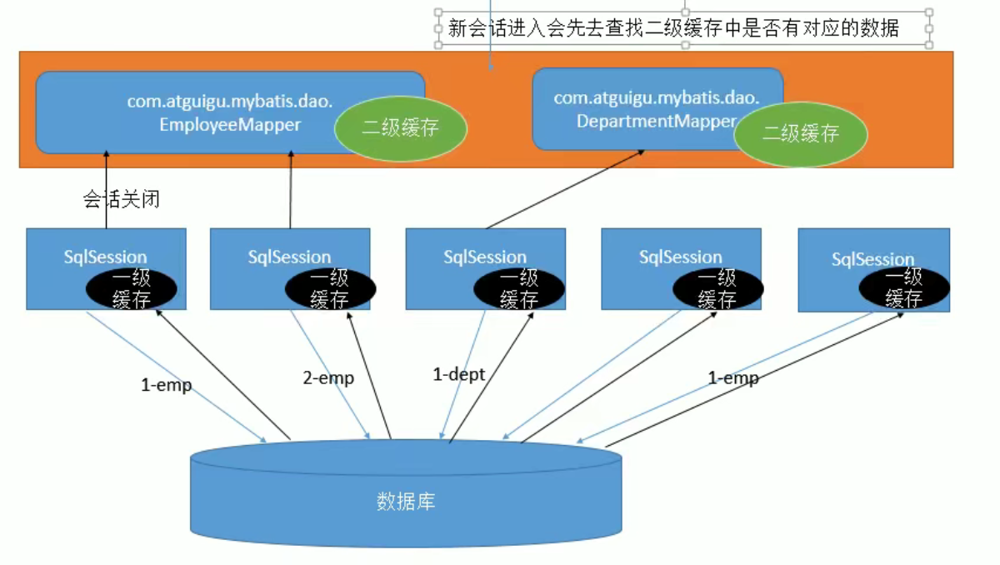
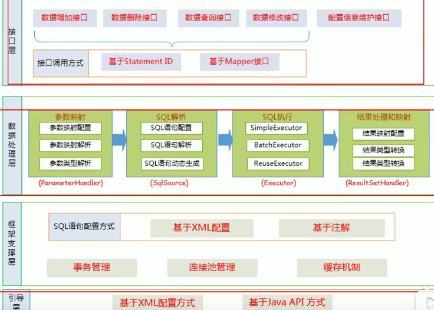
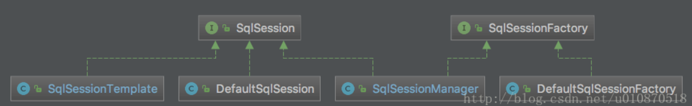

# 1JAVA篇

### 1.1JAVA8新特性

#### 1.1.1默认方法

#### 1.1.2Lamda表达式和函数式接口

#### 1.1.3方法与构造器的引用

+ 可以将构造方法或者方法的引用传递给函数是接口对象

  ```java
  @FunctionalInterface
      public interface Converter<T, F> {
          T convert(F v);
      }
  
      @Test
      public void test() {
          Converter<Integer, Integer> converter = Integer::valueOf;
          Integer converted = converter.convert(1);
          System.out.println(converted);   // 123
      }
  ```

#### 1.1.4Lamda作用域
#### 1.1.5新增接口

+ Predicate: 可传递一个判断表达式，可以组合多个判断表达式成为复杂的判断逻辑
```java
        Predicate<String> p1 = (s) -> s.startsWith("lixin");
        Predicate<String> p2 = (s) -> s.endsWith("lixin");
        System.out.println(p1.and(p2).test("lixinasdfasdfaslixin2"));
```
+ Function: 指定参数和返回值的类型，可以接收函数引用，返回一个结果也可以组合其他函数
```java
        Function<String, Float> stringFloatFunction = Float::parseFloat;
        Function<String, String> floatIntegerFunction = stringFloatFunction.andThen(String::valueOf);
        Function<String, String> findFirstIndexStr = (s) -> String.valueOf(s.charAt(0));
        System.out.println(floatIntegerFunction.andThen(findFirstIndexStr).apply("123.0"));
```
+ Supplier: 没有参数的Function接口
```java
        Supplier supplier = User::new;
        System.out.println(supplier.get());
```
+ Consumer: 传递一个执行操作，调用accept方法执行单个参数的执行操作,也可组合
```java
        Consumer consumer = p -> System.out.println(p);
        consumer.accept(new User());
```

+ Optional: 可以判断空值预防空指针
```java
        System.out.println("Optional.of(\"lixin\") = " + Optional.of("lixin"));
        System.out.println("Optional.of(null).orElse(\"lixin\") = " + Optional.ofNullable(null).orElse("lixin"));
```

+ steam: 一组元素的流式处理，Filter过滤、Sort排序，Map映射、Match匹配
+ parallelStream: 并行流
#### 1.1.6 LocalDate时间API
### 1.2集合框架
#### 1.2.1集合框架的整体架构


+ Set接口:
   + Sorted接口下的TreeSet: 基于红黑树，有序、不可重复、不为空
   + HashSet: 基于哈希表，无序、不可重复、可为空
   + LinkHashSet: 继承自HashSet、有序、不可重复、可为空、内部使用了双向链表来维护元素的插入顺序
+ List接口:
   + ArrayList: 基于简单数组，有序、可重复、可为空
   + Vector: 线程安全的ArrayList，方法上加了同步锁，他扩容是直接扩到两倍
   + LinkList: 基于双向量表，方便删除插入操作，
+ Queue接口:
   + LinkedList: 基于双向量表，方便删除插入操作，
   + PriorityQueue: 基于堆结构实现，可以用它来实现优先队列。
+ Map接口:
  
   + TreeMap: 基于红黑树
   + HashMap: 基于Hash表
   + LinkedHashMap: 基于HashMap，将所有的元素通过一个链表链接起来，插入的有序性
   + HashTable: 线程安全的HashMap

#### 1.2.2ArrayList线程不安全可替代的集合

+ Collections.synchronizedList(); 得到一个线程安全的ArrayList
+ CopyOnWriteArrayList
  + 写操作在一个复制的数组上进行，读操作还是在原始数组中进行，读写分离，互不影响。
  + 写操作需要加锁，防止并发写入时导致写入数据丢失。
  + 写操作结束之后需要把原始数组指向新的复制数组。

+ 占用内存大，存在数据不一致行，读的时候读取不到未同步到读数组中的数据

#### 1.2.3HashMap

+ 1.7扩容条件：

```java

```

+ 1.8改为头插法：
  + 判断链表需不需要转化为树，本身需要遍历链表，
  + 防止循环链表的问题

#### 1.2.4ConcurrentHashMap

> 1.7版本

+ 使用分段数组Segment+链表，容器中会有多个segment，每个segment都相当于是一个hashmap
+ 需要进行两次hash，第一次定位到segment，第二次定位到当前segment的数组下标
+ 使用ReentrantLock加锁锁当前segment的写操作，读不加锁，使用volatile进行控制，保证多线程可见性，

> 1.8版本

+ 

### 1.3java虚拟机

#### 1.3.1见虚拟机篇

### 1.4 多线程

### 1.4.0 **volatile** 

+ 多线程可见，
  + 在写的时候，该线程对应的本地中的共享变量值刷新到主内存。
  + 读的时候，不读本地，读取主存中的变量
+ 防止指令重排
  + 第一个为读操作时，第二个volatile写不允许指令重排序
  + 第一个为volatile读，第二个不允许指令重拍
  + 第一个为volatile写，第二个volatile读写不运行指令重拍

### 1.4.1线程池的优势

+ 降低创建销毁线程的资源消耗
+ 响应迅速，请求到达直接调用创建好的线程，无需等待创建
+ 方便并发数量的管控
+ 提供一些额外的功能，如定时线程池

#### 1.4.2线程池的主要参数

+ corePoolSize（线程池基本大小）：如果当前线程池的线程数小于此值，则会优先创建新的线程，（利用新任务来创建线程）
+ maximumPoolSize（线程池最大的大小）：当队列满了，且已创建的线程数小于maximumPoolSize，则线程池会创建新的线程来执行任务。
+ keepAliveTime（线程存活保持时间）：当线程池中线程数大于核心线程数时，线程的空闲时间如果超过线程存活时间
+ workQueue（任务队列）：用于传输和保存等待执行任务的阻塞队列。
+ threadFactory：用于创建线程
+ handler（线程饱和策略）：当线程池和队列都满的时候会加入此逻辑

#### 1.4.3 jvm内存模型

+ 虚拟机栈、本地方法栈、程序计数器
+ 堆、方法区（运行时常量池）

#### 1.4.4 类加载过程

+ 加载、验证、准备、解析、初始化、使用、卸载
+ 根据全类名加载进虚拟机内存、验证类文件结构（魔数、版本号、常量池语法、类继承规范）等
+ 给类变量赋初值  基本类型和引用类型对应零值
+ 将符号引用转化为直接引用
+ 根据构造方法，按照程序意图来给类变量赋初值

#### 1.4.5 java8默认的垃圾收集器

java -XX:+PrintGCDetails -version 命令

+ Parallel Scavenge（新生代）
  + 吞吐量优先
  + 年轻代
  + 复制算法多线程回收

+ Parallel Old（老年代）
  + 标记-整理算法
  + 老年代
  + 

#### 1.4.6 CMS

+ 标记一清除算法
+ 低延迟，快速响应
+ 老年代
  + 初始标记：标记与GCROOT直接相关联的，STW时间特别短
  + 并发标记：不需要STW，可以与用户线程同事进行
  + 重新标记：对已经标记的对象进行检测，
  + 并发清除：

#### 1.4.7 G1

+ 延迟可控情况下，尽可能提高吞吐量
+ 将内存分为多个区间， G1通过每次只清理一部分而不是全部的Region的增量式清理来保证每次GC停顿时间不会过长
+ 基于复制算法

# 2.框架篇

### 2.1Spring

#### 2.1.1如何解决循环依赖问题

+ 基于构造方法的注入无法解决
+ 基于setter方法的注入可以使用三级缓存解决
  + 一级缓存可以解决吗
    + 对象在创建的时候，两种状态(半成品，成品)，如果都放在一级缓存中，会获取到半成品的bean对象
  + 光是二级能不能
    + 三级缓存中泛型是<beanName,ObjectFactory>，一级二级是具体对象
  + 步骤
    + A从一级缓存中获取，拿不到，直接创建，创建完将未初始化的A加入到三级缓存中
    + A初始化，对A的B属性进行属性注入，B在一级缓存中不存在，则创建B
    + B实例化后放入到三级缓存，
    + 为B的A属性注入，因为A已经在三级缓存中，这是调用getBean(a) 直接从三级缓存拿到A调用getObject方法得到对象（或者代理对象） 注入到B中
    + 在B的A属性注入后，将A加入到耳机缓存中，

### 2.2SpringMvc

#### 2.2.1SpringMvc的启动

+ 在web.xml中定义contextConfigLocation,

  ```xml
  <context-param>
      <param-name>contextConfigLocation</param-name>
      <param-value>
          classpath*:conf/spring/applicationContext_core*.xml,
          classpath*:conf/spring/applicationContext_dict*.xml,
          classpath*:conf/spring/applicationContext_hibernate.xml,
      </param-value>
  </context-param>
  ```

+ 使用ContextLoaderServlet，这个类实现了在servlet启动的时候自动去找WEB-INF下面的applicationContext.xml,

  这个类实现

  ```xml
  <servlet>
     　　<servlet-name>context</servlet-arne>
  　　　　<servlet-class>org.springframework.web.context.ContextLoaderServlet</servlet-class>
     　　<load-on-startup>l</load-on-startup>
  </servlet>
  ```

+ 关于ContextLoaderListener，它实现了ServletContextListener，重写了contextInitialized()方法，在容器的启动的时候调用，在此处启动webapplicationcontext，并且寻找，其他的容器作为自己的父容器

+ Web容器启动的全部过程

  + 解析context-param创建一个application对象
  + 读取listener，ContextLoaderListener会创建一个WebApplication对象，创建contextConfigation中的配置，并设置父容器
  + litener创建完城后会创建Filter
  + 初始化Servlet，一般使用DispatchServlet类

#### 2.2.2SpringMvc的调用过程

+ 客户端发送请求，请求到DispathcherServlet（DispathcherServlet是一个Servlet被注册在web.xml中）
+ DispathcherServlet将请求交给HandlerMapping，HandlerMapping找到对应的处理器，生成处理器执行链（包含处理器对象和处理器拦截器）
+ DispathcherServlet根据返回的处理器，获取处理器适配器并执行一系列操作，参数疯转，数据转换等
+ 执行处理器，返回一个modelandview对象。
+ ViewResolver会根据View找到实际的View
+ DispatcherServlet将Model传给View
+ 将View返回给请求者

#### 2.2.3 ResponseBody注解的原理

#### 2.2.4 spring事务传播

#### 2.2.5 springboot如何实现自动配置（启动流程）

#### 2.2.6 FactoryBean原理

#### 2.2.7 如何实现autowired，如何注入底层组件（ApplicationContext、）

作用位置

+ 构造器：默认的spring会调用无参构造器，在对属性进行赋值。注解在构造器上，则spring使用构造器进行赋值注入，构造器参数从容器中拿，如果只有一个有参构造器，则可以省略该注解
+ set方法：依赖注入使用set方法赋值，set方法中参数从容器中取
+ 参数和属性

注入底层bean

+ 自定义类实现xxxAware，spring启动的时候会进行回调（后置处理器，例如ApplicationContextAwareProcessor），将对应的参数传入回调方法

autowired实现原理

+ 

#### 2.2.8 spring AOP实现原理

+ @EnableAspectJAutoProxy  内部使用@import（实现beandefineationregistryer接口方式）引入一个组件

+ 这个组件引入了一个AnnotationAwareAspectJAutoProxyCreator.class自动代理创建器

+ 自动代理创建器继承自AbstractAutoProxyCreator并且实现了SmartInstantiationAwareBeanPostProcessor和BeanFactoryAware接口

+ SmartInstantiationAwareBeanPostProcessor在bean初始化前后调用，BeanFactoryAware可以实现beanFactory的装配

+ 容器启动会将该类注册到beanPostPorcessor中

+ 在bean创建过程

  + 实例化
  + 属性赋值
  + 初始化
    + 回调用Aware接口（BeanFactoryAware）
    + 调用后置处理器before方法
    + 调用初始化方法
    + 调用后置处理器after方法

+ 在后置处理器的before方法中

  ```java
  try {
     // Give BeanPostProcessors a chance to return a proxy instead of the target bean instance.
     Object bean = resolveBeforeInstantiation(beanName, mbdToUse);
     if (bean != null) {
        return bean;
     }
  }
  ```
  
+ 顶层代理创建器抽象类，回调方法在创建bean之前调用，

  每一个bean创建之前都会调用

  advisedBeans保存了所有增强的bean，这里需要判断

  ```java
  public Object postProcessBeforeInstantiation(Class<?> beanClass, String beanName) {
     Object cacheKey = getCacheKey(beanClass, beanName);
  
     if (!StringUtils.hasLength(beanName) || !this.targetSourcedBeans.contains(beanName)) {
        if (this.advisedBeans.containsKey(cacheKey)) {
           return null;
        }
        if (isInfrastructureClass(beanClass) || shouldSkip(beanClass, beanName)) {
           this.advisedBeans.put(cacheKey, Boolean.FALSE);
           return null;
        }
     }
  
     // Create proxy here if we have a custom TargetSource.
     // Suppresses unnecessary default instantiation of the target bean:
     // The TargetSource will handle target instances in a custom fashion.
     TargetSource targetSource = getCustomTargetSource(beanClass, beanName);
     if (targetSource != null) {
        if (StringUtils.hasLength(beanName)) {
           this.targetSourcedBeans.add(beanName);
        }
        Object[] specificInterceptors = getAdvicesAndAdvisorsForBean(beanClass, beanName, targetSource);
        Object proxy = createProxy(beanClass, beanName, specificInterceptors, targetSource);
        this.proxyTypes.put(cacheKey, proxy.getClass());
        return proxy;
     }
  
     return null;
  }
  ```

  bean初始化后，

  1、从前面的增强器集合中判断，判断当前bean可以使用的增强器，给增强器进行排序

  2、增强器的集合不为空，则创建bean的代理对象

  3、创建代理

  	 + 获取所有增强器
  	 + 把增强器保存到代理工厂对象中，proxyFactory
  	 + 如果实现了接口，则调用jdk动态代理，否则调用cglib动态代理

  

  ```java
  
  
  @Override
  public Object postProcessAfterInitialization(@Nullable Object bean, String beanName) {
     if (bean != null) {
        Object cacheKey = getCacheKey(bean.getClass(), beanName);
        if (this.earlyProxyReferences.remove(cacheKey) != bean) {
           return wrapIfNecessary(bean, beanName, cacheKey);
        }
     }
     return bean;
  }
  ```


#### 2.2.9 BeanPostProcessor和InstantiationAwareBeanPostProcessor有什么区别

后者继承与前者

后者回调在创建bean之前，给一个机会返回一个代理对象，

前者执行在对象初始化前后

### 2.4Mybatis

#### 2.4.1mybatis的缓存

+ 一级缓存:存储在SqlSession中
  + 一级缓存失效情况：
    + sqlsession不同
    + 使用不同的查询条件
    + 两次查询之间执行了增删改
    + 手动调用了clearCache方法

+ 二级缓存：namespace级别的，一个namespace对应一个二级缓存

  + 会话关闭，一级缓存中的数据会保存到二级缓存

  + 二级缓存的配置项

    + evicition：缓存的回收策略 LRU、FIFO、软引用、弱引用
    + flusInternval：缓存的刷新时间
    + readOnly：
      + true表示只读操作myabtis直接返回缓存的引用，速度较快；
      + false的话表示有可能修改，mybatis会将数据进行序列化
  

#### 2.4.2mybatis的执行流程

+ 二级缓存的使用
    + 全局开启二级缓存，二级缓存默认不开（一级缓存默认开启）
    + 在mapper.xml中配置<cache/>
    + pojo需要支持序列化
  
+ 缓存的设置

  + 在setting中设置enableCache表示关闭二级缓存，

  + 在select标签中useCache=false 也表示关闭二级缓存

  + 在每个增伤改标签，中的flushCache都是默认true表示执行增删改操作之后都会清空一二级缓存，

    查询标签是false，表示简单查询不清缓存

  + sqlsession.clearCache()只清楚一级缓存

  + localCacheScope：本地缓存作用域





#### 2.4.3 原理




+ 首先通过全局配置文件，通过Resource.getResourceAssTream()方法构建SqlSessionFactory，通过配置文件下，创建一个Configuration的对象此对象包含了所有的配置和MapStatement
+ 获取SqlSession
  
  + 创建Executor对象，判断Executor类型创建对应的Executor，如果配置了二级缓存则使用CachingExecutor，调用所有拦截器的plugin方法
  + 将executor和configuation封装成defaultSqlSession返回，这个sqlsession不是线程安全的
+ getMapper

    + 通过Configuration对象中的mapperRegistry 创建一个MapperProxy代理对象，这个代理对象里包含了Executor
+ 执行Sql

    + 判断增删改查类型创建一个Executor
    + 创建一个StatementHandler，这个对象可以创建出一个Statement对象
    + 通过ParmeterHandler设置参数值，通过ResultSetHandler封装结果集
    +  2.4.3插件的运行机制


#### 2.4.4mybatis的Excutor有几种类型

+ SimpleExecutor**（默认)**：每次执行都会创建一个，用完关闭
+ ReuseExecutor：先以sql作为key查找statement对象，找到使用，找不到则创建，使用完不关闭，可以重复利用。
+ BatchExecutor：向数据库批量提交sql执行
+ CachingExecutor：当开启二级缓存的时候，会初始化一个CachingExecutor，这个CachingExecutor就是将上面三个包装了一下

#### 2.4.5和spring整合是如何保证线程安全的

+ SqlSession的实现图

  


+ defaultSqlsession是线程不安全的，SqlSessionTemplate解决了线程安全的问题，

  ```java
  // 在SqlSessionTemplate的构造方法中创建了sqlSession的代理对象，代理对象的执行就是在SqlSessionInterceptor中的invoke方法中实现的（因为SqlSessionInterceptor实现了InvocationHandler类，使用JDK的动态代理）
  public SqlSessionTemplate(SqlSessionFactory sqlSessionFactory, ExecutorType executorType,
        PersistenceExceptionTranslator exceptionTranslator) {
  
      notNull(sqlSessionFactory, "Property 'sqlSessionFactory' is required");
      notNull(executorType, "Property 'executorType' is required");
  
      this.sqlSessionFactory = sqlSessionFactory;
      this.executorType = executorType;
      this.exceptionTranslator = exceptionTranslator;
      this.sqlSessionProxy = (SqlSession) newProxyInstance(SqlSessionFactory.class.getClassLoader(),
          new Class[] { SqlSession.class }, new SqlSessionInterceptor());
    }
  ```

```java
  // 在创建SqlSessionProxy的代理对象的时候会从TransactionSynchronizationManager(事务管理器)获取一个ThreadLocal的对象，
  // 如果获取不到则会创建一个新的并注册到事务管理器
  SqlSessionHolder holder = (SqlSessionHolder) TransactionSynchronizationManager.getResource(sessionFactory);
  
  
  // resources对象的 通过resource可以拿到当前线程中的
  public abstract class TransactionSynchronizationManager {
  
  	private static final Log logger = LogFactory.getLog(TransactionSynchronizationManager.class);
  
  	private static final ThreadLocal<Map<Object, Object>> resources =
  			new NamedThreadLocal<>("Transactional resources");
```

  


# 3.数据库

### 3.1MySql

#### 3.1.1 b树和b+树有啥区别

+ 

### 3.2Redis
#### 3.2.1 redis和memcache区别

+ redis比memcache拥有更多的数据类型
+ redis支持集群模式，memcache原生不支持集群

#### 3.2.2 redis的线程模型

#### 3.2.3 redis主线程为什么是单线程

主线程只在内存中操作，不涉及IO，不会阻塞，多线程会切换上下文，会造成额外的消耗

#### 3.2.4 rdb持久化

+ save命令会阻塞当前服务器知道rdb过程完成，bgsave会创建一个子线程执行，只会阻塞创建子线程的一段时间
+ rdb文件默认会进行压缩，方便存储和网络传输
+ 记录了某个时间点的全量数据，适合备份、全量赋值场景
+ bgsave执行成本比较高
+ rdb无法真正解决实时持久化问题

#### 3.2.5 什么时候会触发bgsave

+ 手动执行命令
+ 配置策略 save  m秒  n次修改
+ 执行 debug reload 重新加载redis
+ shutdown 关机自动rdb


# 4.大数据篇

### 4.1Hadoop

### 4.2Hdfs

### 4.3Hive

### 4.4MapReduce


