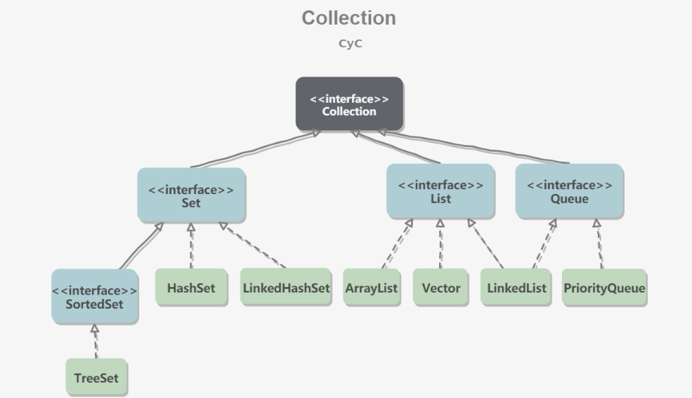
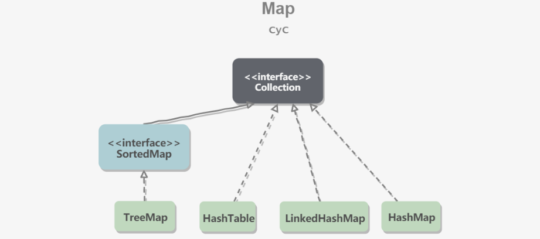

# 1JAVA篇

### 1.1JAVA8新特性

#### 1.1.1默认方法

#### 1.1.2Lamda表达式和函数式接口

#### 1.1.3方法与构造器的引用

+ 可以将构造方法或者方法的引用传递给函数是接口对象

  ```java
  @FunctionalInterface
      public interface Converter<T, F> {
          T convert(F v);
      }
  
      @Test
      public void test() {
          Converter<Integer, Integer> converter = Integer::valueOf;
          Integer converted = converter.convert(1);
          System.out.println(converted);   // 123
      }
  ```

#### 1.1.4Lamda作用域
#### 1.1.5新增接口

+ Predicate: 可传递一个判断表达式，可以组合多个判断表达式成为复杂的判断逻辑
```java
        Predicate<String> p1 = (s) -> s.startsWith("lixin");
        Predicate<String> p2 = (s) -> s.endsWith("lixin");
        System.out.println(p1.and(p2).test("lixinasdfasdfaslixin2"));
```
+ Function: 指定参数和返回值的类型，可以接收函数引用，返回一个结果也可以组合其他函数
```java
        Function<String, Float> stringFloatFunction = Float::parseFloat;
        Function<String, String> floatIntegerFunction = stringFloatFunction.andThen(String::valueOf);
        Function<String, String> findFirstIndexStr = (s) -> String.valueOf(s.charAt(0));
        System.out.println(floatIntegerFunction.andThen(findFirstIndexStr).apply("123.0"));
```
+ Supplier: 没有参数的Function接口
```java
        Supplier supplier = User::new;
        System.out.println(supplier.get());
```
+ Consumer: 传递一个执行操作，调用accept方法执行单个参数的执行操作,也可组合
```java
        Consumer consumer = p -> System.out.println(p);
        consumer.accept(new User());
```

+ Optional: 可以判断空值预防空指针
```java
        System.out.println("Optional.of(\"lixin\") = " + Optional.of("lixin"));
        System.out.println("Optional.of(null).orElse(\"lixin\") = " + Optional.ofNullable(null).orElse("lixin"));
```

+ steam: 一组元素的流式处理，Filter过滤、Sort排序，Map映射、Match匹配
+ parallelStream: 并行流
#### 1.1.6 LocalDate时间API
### 1.2集合框架
#### 1.2.1集合框架的整体架构



+ Set接口:
   + Sorted接口下的TreeSet: 基于红黑树，有序、不可重复、不为空
   + HashSet: 基于哈希表，无序、不可重复、可为空
   + LinkHashSet: 继承自HashSet、有序、不可重复、可为空、内部使用了双向链表来维护元素的插入顺序
+ List接口:
   + ArrayList: 基于简单数组，有序、可重复、可为空
   + Vector: 线程安全的ArrayList，方法上加了同步锁，他扩容是直接扩到两倍
   + LinkList: 基于双向量表，方便删除插入操作，
+ Queue接口:
   + LinkedList: 基于双向量表，方便删除插入操作，
   + PriorityQueue: 基于堆结构实现，可以用它来实现优先队列。
+ Map接口:
  
   + TreeMap: 基于红黑树
   + HashMap: 基于Hash表
   + LinkedHashMap: 基于双向量表
   + HashTable: 线程安全的HashMap

#### 1.2.2ArrayList线程不安全可替代的集合

+ Collections.synchronizedList(); 得到一个线程安全的ArrayList
+ CopyOnWriteArrayList
  + 写操作在一个复制的数组上进行，读操作还是在原始数组中进行，读写分离，互不影响。
  + 写操作需要加锁，防止并发写入时导致写入数据丢失。
  + 写操作结束之后需要把原始数组指向新的复制数组。

+ 占用内存大，存在数据不一致行，读的时候读取不到未同步到读数组中的数据

#### 1.2.3HashMap

+ 1.7扩容条件：

```java

```

+ 1.8改为头插法：
  + 判断链表需不需要转化为树，本身需要遍历链表，
  + 防止循环链表的问题

#### 1.2.4ConcurrentHashMap

+ 

### 1.3java虚拟机

#### 1.3.1见虚拟机篇

# 2.框架篇

### 2.1Spring

#### 2.1.1如何解决循环依赖问题

+ 基于构造方法的注入无法解决
+ 基于setter方法的注入可以使用三级缓存解决
  + 一级缓存可以解决吗
    + 对象在创建的时候，两种状态(半成品，成品)，如果都放在一级缓存中，会获取到半成品的bean对象
  + 光是二级能不能
    + 三级缓存中泛型是<beanName,ObjectFactory>，一级二级是具体对象
  + 步骤
    + A从一级缓存中获取，拿不到，直接创建，创建完将未初始化的A加入到三级缓存中
    + A初始化，对A的B属性进行属性注入，B在一级缓存中不存在，则创建B
    + B实例化后放入到三级缓存，
    + 为B的A属性注入，因为A已经在三级缓存中，这是调用getBean(a) 直接从三级缓存拿到A调用getObject方法得到对象（或者代理对象） 注入到B中
    + 在B的A属性注入后，将A加入到耳机缓存中，

### 2.2SpringMvc

#### 2.2.1SpringMvc的启动

+ 在web.xml中定义contextConfigLocation,

  ```xml
  <context-param>
      <param-name>contextConfigLocation</param-name>
      <param-value>
          classpath*:conf/spring/applicationContext_core*.xml,
          classpath*:conf/spring/applicationContext_dict*.xml,
          classpath*:conf/spring/applicationContext_hibernate.xml,
      </param-value>
  </context-param>
  ```

+ 使用ContextLoaderServlet，这个类实现了在servlet启动的时候自动去找WEB-INF下面的applicationContext.xml,

  这个类实现

  ```xml
  <servlet>
     　　<servlet-name>context</servlet-arne>
  　　　　<servlet-class>org.springframework.web.context.ContextLoaderServlet</servlet-class>
     　　<load-on-startup>l</load-on-startup>
  </servlet>
  ```

+ 关于ContextLoaderListener，它实现了ServletContextListener，重写了contextInitialized()方法，在容器的启动的时候调用，在此处启动webapplicationcontext，并且寻找，其他的容器作为自己的父容器

+ Web容器启动的全部过程

  + 解析context-param创建一个application对象
  + 读取listener，ContextLoaderListener会创建一个WebApplication对象，创建contextConfigation中的配置，并设置父容器
  + litener创建完城后会创建Filter
  + 初始化Servlet，一般使用DispatchServlet类

#### 2.2.2SpringMvc的调用过程

+ 客户端发送请求，请求到DispathcherServlet
+ DispatcherServlet 根据URL找到对应的HandlerMapping，解析到对应的Handler
+ 交给HandlerAdapter处理，调用真正的处理逻辑，处理结果返回一个ModelAndView对象 Model封装了数据
+ ViewResolver会根据View找到实际的View
+ DispatcherServlet将Model传给View
+ 将View返回给请求者


### 2.3Springboot

### 2.4Mybatis

# 3.数据库

### 3.1MySql

# 4.大数据篇

### 4.1Hadoop

### 4.2Hdfs

### 4.3Hive

### 4.4MapReduce


