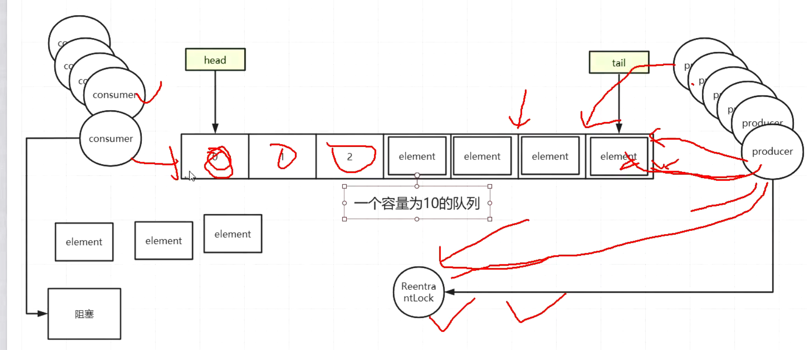

## 阻塞队列ArrayBlockingQueue

### 1.1 常用的阻塞队列

> 在任一时刻，不管并发有多高，单JVM上面，永远只有一个线程进行入队和出队的操作

+ ArrayBlockingQueue：由数组支持的有界队列
+ LinkedBlockingQueue：由链表支持的可选有界队列
+ PriorityBlockQueue：由优先级堆支持的无界优先队列
+ DelayQueue：优先级堆支持的、基于时间的调度队列


### 1.2 原理分析




#### 1.2.1 构造方法

```java
public ArrayBlockingQueue(int capacity, boolean fair) {
    if (capacity <= 0)
        throw new IllegalArgumentException();
    this.items = new Object[capacity]; // 队列
    lock = new ReentrantLock(fair); // 加入元素和获取元素都需要进行加锁
    notEmpty = lock.newCondition(); // 如果队列放满了，无法再放入，当前线程需要释放调锁用的condition对象
    notFull =  lock.newCondition();
}
```

#### 1.2.2 put方法

```java
public void put(E e) throws InterruptedException {
    checkNotNull(e);
    final ReentrantLock lock = this.lock;
    lock.lockInterruptibly();
    try {
        while (count == items.length)
            // 如果队列满了，要使用condition来
            notFull.await();
        enqueue(e);
    } finally {
        lock.unlock();
    }
}
```

notFull.await()方法

```java
public final void await() throws InterruptedException {
    if (Thread.interrupted())
        throw new InterruptedException();
    // 加入条件等待队列
    Node node = addConditionWaiter();
    int savedState = fullyRelease(node);
    int interruptMode = 0;
    while (!isOnSyncQueue(node)) {
        LockSupport.park(this);
        if ((interruptMode = checkInterruptWhileWaiting(node)) != 0)
            break;
    }
    if (acquireQueued(node, savedState) && interruptMode != THROW_IE)
        interruptMode = REINTERRUPT;
    if (node.nextWaiter != null) // clean up if cancelled
        unlinkCancelledWaiters();
    if (interruptMode != 0)
        reportInterruptAfterWait(interruptMode);
}
```

