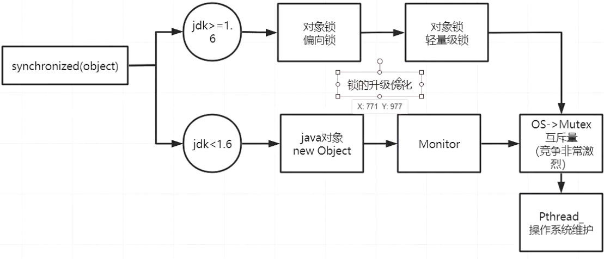
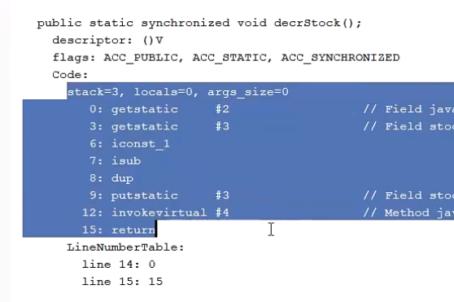
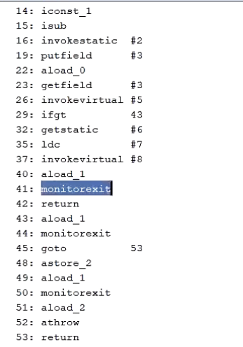
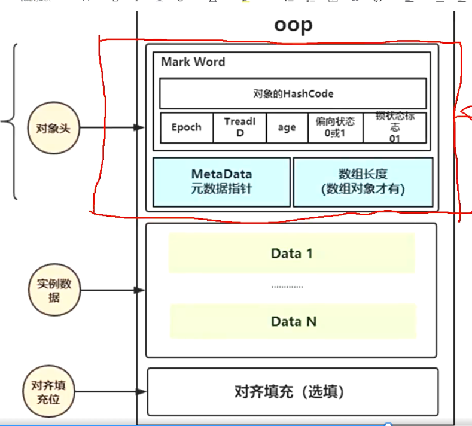
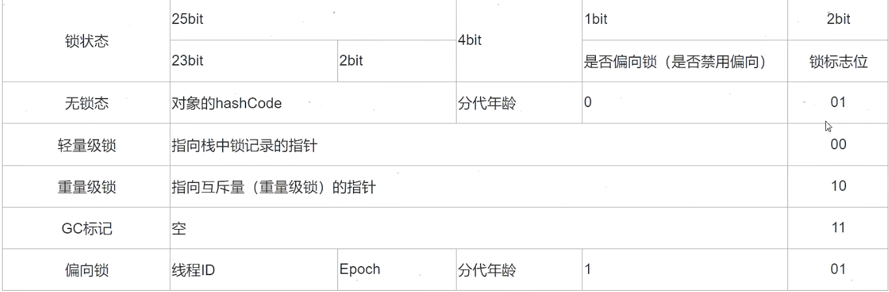

# Synchronized

### 1.1 原理

> 锁对象，每new一个锁对象，同时会new一个Monitor对象(管程对象)，Monitor对象依赖于OS-Mutex互斥量。OS-Mutex是由操作系统来维护的，使用Phread库来维护，在这里需要切换线程状态，所以效率比较低

### 1.2 使用

+ 修饰静态方法：加锁在当前类的类对象上 JUC.class
+ 修饰普通方法：加载当前对象上面，那个对象调用这个方法，就加载这个对象上
+ 方法内部同步块：加载括号内对象上

### 1.3 底层原理

#### 1.3.1 字节码层面

如果是加在方法上，则字节码编译后的方法的flag上有acc-synchronized

如果是使用同步块，会添加monitorenter和monitorexit，monitorexit有两个，处理异常和return

#### 1.3.2 对象层面

偏向锁默认开启，但是启动会延迟与虚拟机启动4秒后。

如果开启偏向锁的状态，默认对象是匿名偏向状态(可偏向状态)，此时线程id字段为空

##### 1.3.2.1 对象的内存模型

#### 1.3.2.2 锁标志位

> 1、主要看最后三位，001无锁，00轻量级锁、10重量级锁、101偏向锁
>
> 2、轻量级锁的hashcode记录在栈中，发生轻量级锁的时候会在栈内创建一个区域LockRecord，这个区域会赋值锁对象的markword的部分数据，这个过程使用CAS保证线程安全
>
> 3、偏向锁的hashcode有可能记录在monitor对象中，调用锁对象的hashcode方法可以使偏向锁转化为轻量级锁
>
> 4、重量级锁的hashcode记录在monitor对象中

### 1.4 锁升级过程

**默认无锁或者匿名偏向**----->有线程访问--------> **偏向锁**---->多线程访问------>**轻量级锁**------>轻量级锁自旋超过一定次数------>**重量级锁**

### 1.5 Monitor对象