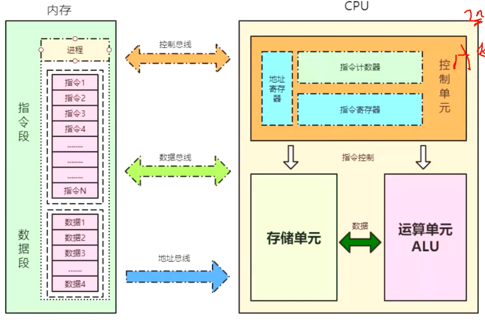
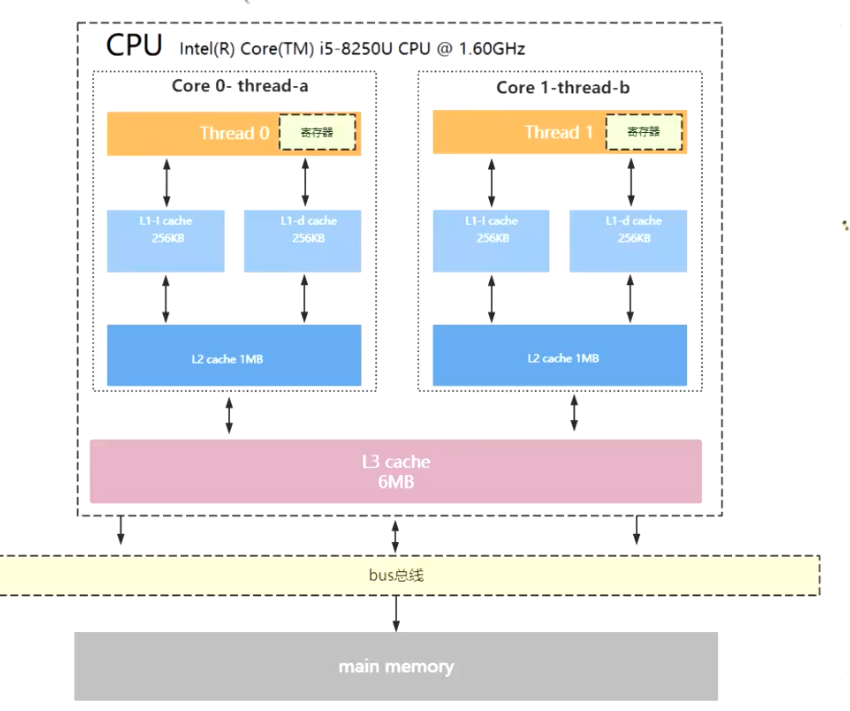
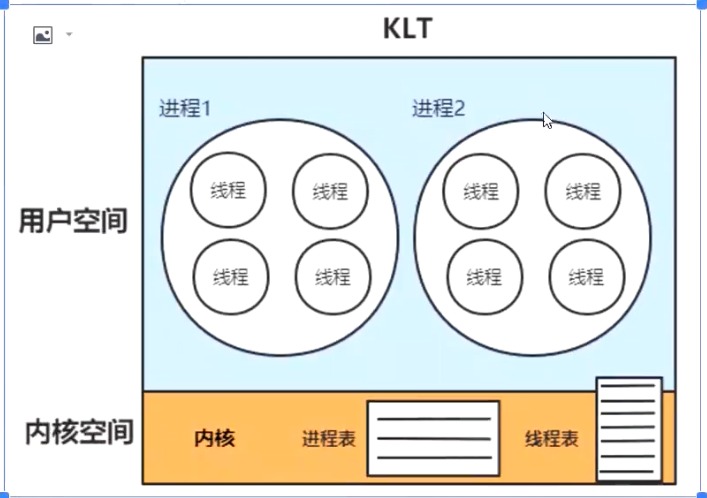

## 计算机操作系统

### 一、冯诺依曼的计算机体系

### 1.1 CPU架构和CPU指令

+ X86
+ ARM

> CPU在出场的时候会封装好CPU指令，我们使用会变语言操作CPU指令，不需要再输入01二进制数

### 1.2 CPU和内存模型

+ 控制单元

  + 指令计数器
  + 指令寄存器
  + 地址寄存器

+ 存储单元

  + 指令
  + 指令操作的数据

+ 运算单元

  > 进行算数运算

+ 内存的每个进程
  + 指令段
  + 数据段

### 1.3 CPU的缓存架构

> CPU速度较快，内存速度慢，CPU为减少访问内存次数，设置多级缓存

按照读取速度快慢（离CPU距离远近排序）

> CPU寄存器->L1->L2->-L3>内存

L1（存指令和数据两种，所以有两个）、L2每个核心独享，L3多个核心共享

### 1.4 CPU读取数据的原则

+ 空间局部性原则
+ 时间局部性原则

### 1.5 CPU运行安全级别和线程状态切换

ring0：核心态(kernal memary)

ring1：

ring2：

ring3：用户态(user memary)

> 创建一个线程执行任务并销毁的步骤为
>
> 1、CPU从ring3转换到ring0，创建一个线程
>
> 2、创建完成后从ring0切换回ring3
>
> 3、ring3执行JVM程序
>
> 4、切换回ring0销毁线程

用户态到内核态的切换，也伴随着堆栈的拷贝

### 1.6 KLT线程模型和ULT线程模型

> KLT 内核保存线程状态和上下文信息，线程阻塞不会阻塞进程

> ULT 线程创建销毁，内核无感，不依赖操作系统创建和销毁线程，线程阻塞则进程阻塞

### 1.7 进程与线程

### 1.8 虚拟机指令架构

+ 寄存器指令架构
+ 栈指令架构