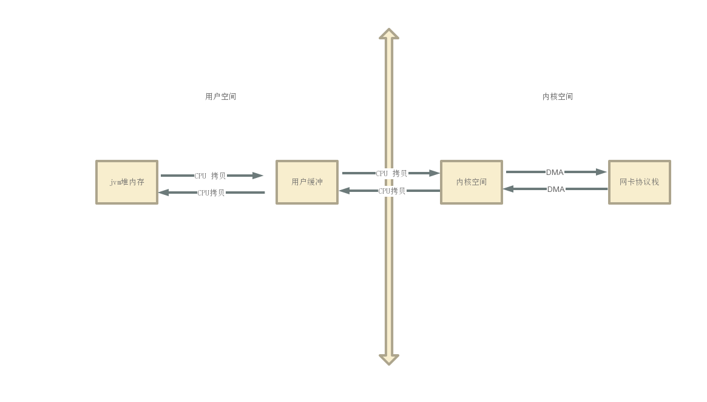

### 尼恩葵花宝典

### 1.1 零拷贝

> 节省了内核空间和用户空间、用户空间和用户空间之间的拷贝都叫零拷贝

写入流程

+ 用户进空间调用write函数，将数据写入到内核缓冲
+ 调用sys_writer 写入到内核缓冲区（socket发送缓冲、或者文件系统缓存）
+ DMA拷贝到网络协议栈或者磁盘
+ write函数返回

#### 1.1.2 为什么要进行数据copy

> 本质上是因为JVM自动内存管理，GC会改变对象的地址，所以需要将数据copy到直接内存，直接内存会保证后面copy的过程中内存地址会找到完整的数据

#### 1.1.3 零拷贝方式——使用Directuffer

+ 使用直接内存可以避免堆内存到用户缓冲区的拷贝

#### 1.1.4 使用mmap（内存映射文件）

+ 内存地址和文件进行映射
+ 对于java程序来讲，他减少了两次CPU的复制

#### 1.1.4 sendfile

### 1.2 什么时候会进行状态转换

#### 1.2.1 系统调用

#### 1.2.2 异常

#### 1.2.3 硬中断
