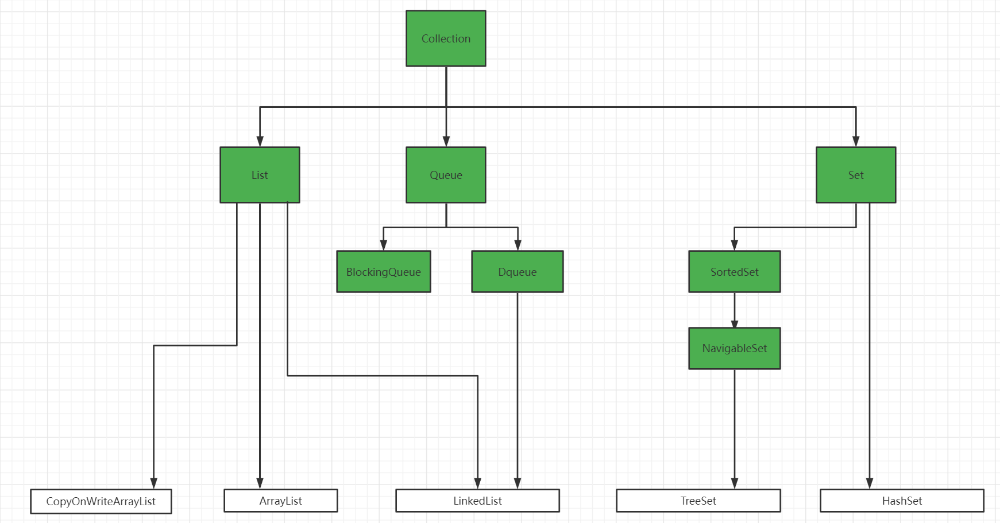
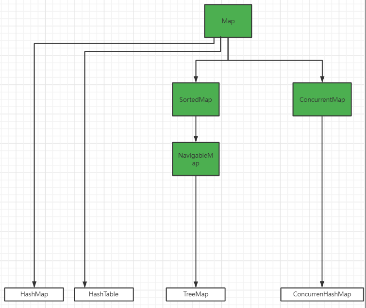
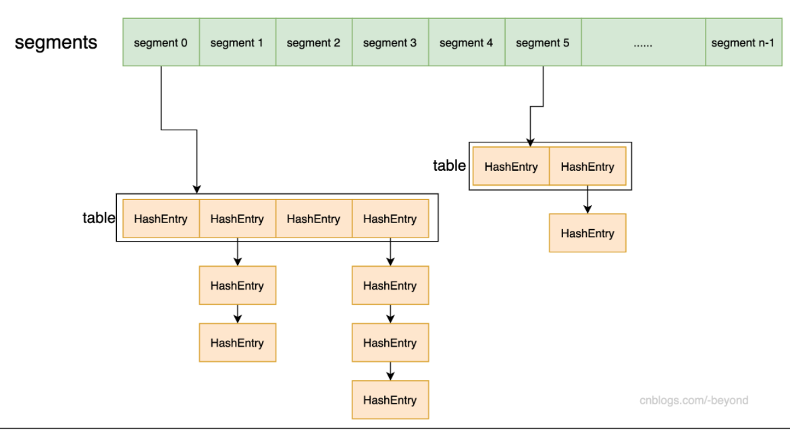

# 集合框架

## 一、Collection接口

### 1.1 整体继承关系




双向链表，内部实现了一个Node类，构造方法支持，pre，next和element传参

```java
private static class Node<E> {
        E item;
        Node<E> next;
        Node<E> prev;
        Node(Node<E> prev, E element, Node<E> next) {
            this.item = element;
            this.next = next;
            this.prev = prev;
        }
    }
```

> **该类实现了Dqueue，该接口定义了双端链表，分别可以从头部和尾部进行插入和删除操作**

### 1.3 ArrayList

单纯使用Object数组实现，预先预留一定的数组空闲空间，空间不够进行扩容，扩容每次扩容到原来的1.5倍

### 1.4 CopyOnWriteArrayList

使用写时复制算法，底层实现还是Object[] array; 通过 ReentrantLock+ volite实现，读不加锁，写使用通一把锁，写时将数组copy一份，操作备份数组，写完成后替换原数组。

+ 优点：空间换时间，写不阻塞读
+ 缺点：写阻塞，只适合读多写少的场景，写时读无法获取最新的写数据

```java
public boolean add(E e) {
        final ReentrantLock lock = this.lock;
        lock.lock();
        try {
            Object[] elements = getArray();
            int len = elements.length;
            Object[] newElements = Arrays.copyOf(elements, len + 1);
            newElements[len] = e;
            setArray(newElements);
            return true;
        } finally {
            lock.unlock();
        }
    }
```


### 1.5 TreeSet

使用TreeMap的Key进行操作，value为object对象

```java
public TreeSet() {
    this(new TreeMap<E,Object>());
}

public boolean add(E e) {
    return m.put(e, PRESENT)==null;
}
```

### 1.6 HashSet

同TreeSet一样，使用HashMap的key进行操作，value为Object对象

```java
public HashSet() {
    map = new HashMap<>();
}

public boolean add(E e) {
    return map.put(e, PRESENT)==null;
}

```

## 二、Map接口

> 整体继承关系



### 2.1 HashMap

#### 2.1.1 数据结构

> 数组+链表+红黑树

#### 2.1.2 初始化Object数组（获取一个2的n次幂）

+ 1.8 

```java
static final int tableSizeFor(int cap) {
    // 先进行减1，避免cap就是一个2的n次幂
    int n = cap - 1;
    n |= n >>> 1;
    n |= n >>> 2;
    n |= n >>> 4;
    n |= n >>> 8;
    n |= n >>> 16;
    // 通过移位运算后，n由00000000 00000000 00000000 00010001变成了
    // 00000000 00000000 00000000 00011111 这种，这个数只比目标数小1
  	// 如果最终结果不大于最大值，直接返回n+1即可
    return (n < 0) ? 1 : (n >= MAXIMUM_CAPACITY) ? MAXIMUM_CAPACITY : n + 1;
}
```

+ 1.7 调用Integer的higestOneBit方法，传入参数为  cap < 1 - 1 相当于乘以2减1

```java
public static int highestOneBit(int i) {
	// HD, Figure 3-1
	i |= (i >>  1);
	i |= (i >>  2);
	i |= (i >>  4);
	i |= (i >>  8);
	i |= (i >> 16);
	return i - (i >>> 1);
}
```

#### 2.1.3 hash()

```java
static final int hash(Object key) {
    int h;
    // 这里将高位和地位进行异或运算，为了表面数组长度比较小的时候，忽略高位对数组index计算的影响
    return (key == null) ? 0 : (h = key.hashCode()) ^ (h >>> 16);
}
```

#### 2.1.4 put()

```java
final V putVal(int hash, K key, V value, boolean onlyIfAbsent,
               boolean evict) {
    Node<K,V>[] tab; Node<K,V> p; int n, i;
    if ((tab = table) == null || (n = tab.length) == 0)
       	// 这里对数组进行了初始化，调用空构造方法的时候，只是制定了加载因子，未进行初始化
        n = (tab = resize()).length;
    // 这里使用hash值与数组size-1进行与运算计算下标
    if ((p = tab[i = (n - 1) & hash]) == null)
        // 这个桶里面没有元素，直接创建一个node，放进去
        tab[i] = newNode(hash, key, value, null);
    else {
        // 已经有元素，代表出现了hash冲突
        Node<K,V> e; K k;
        if (p.hash == hash &&
            ((k = p.key) == key || (key != null && key.equals(k))))
            // 这里先比对hash值，在比对key值
            e = p;
        else if (p instanceof TreeNode)
            // 如果顶层节点是红黑树类型，则调用红黑树插入
            e = ((TreeNode<K,V>)p).putTreeVal(this, tab, hash, key, value);
        else {
            // 不是红黑树，说明还是链表
            for (int binCount = 0; ; ++binCount) {
                if ((e = p.next) == null) {
                    // 如果下一个是null，则可以直接插入，因为首个元素在前面已经判断过了
                    p.next = newNode(hash, key, value, null);
                    // 当前循环走完binCount才会++，也就是说，只有原有的元素>=8的时候
                    // 或者插入新元素完后，链表长度>8才转化为红黑树
                    if (binCount >= TREEIFY_THRESHOLD - 1) // -1 for 1st
                        treeifyBin(tab, hash);
                    break;
                }
                // 如果当前元素
                if (e.hash == hash &&
                    ((k = e.key) == key || (key != null && key.equals(k))))
                    break;
                p = e;
            }
        }
        // 这里如果是已经存在的key，需要将原来的值返回
        if (e != null) { // existing mapping for key
            V oldValue = e.value;
            if (!onlyIfAbsent || oldValue == null)
                e.value = value;
            afterNodeAccess(e);
            return oldValue;
        }
    }
    ++modCount;
    // 维护size，如果大于
    if (++size > threshold)
        resize();
    // 这里是给linkedHashmap插入元素后进行的回调
    afterNodeInsertion(evict);
    return null;
}
```

#### 2.1.5 resize()

```java
final Node<K,V>[] resize() {
    Node<K,V>[] oldTab = table;
    int oldCap = (oldTab == null) ? 0 : oldTab.length;
    int oldThr = threshold;
    int newCap, newThr = 0;
    if (oldCap > 0) {
    	// 之前未进行初始化过，在此处扩容
        if (oldCap >= MAXIMUM_CAPACITY) {
            threshold = Integer.MAX_VALUE;
            return oldTab;
        }
        // 扩容两倍
        else if ((newCap = oldCap << 1) < MAXIMUM_CAPACITY &&
                 oldCap >= DEFAULT_INITIAL_CAPACITY)
            newThr = oldThr << 1; // double threshold
    }
    else if (oldThr > 0) // initial capacity was placed in threshold
        newCap = oldThr;
    else {               // zero initial threshold signifies using defaults
        newCap = DEFAULT_INITIAL_CAPACITY;
        newThr = (int)(DEFAULT_LOAD_FACTOR * DEFAULT_INITIAL_CAPACITY);
    }
    if (newThr == 0) {
        float ft = (float)newCap * loadFactor;
        newThr = (newCap < MAXIMUM_CAPACITY && ft < (float)MAXIMUM_CAPACITY ?
                  (int)ft : Integer.MAX_VALUE);
    }
    threshold = newThr;
    @SuppressWarnings({"rawtypes","unchecked"})
    Node<K,V>[] newTab = (Node<K,V>[])new Node[newCap];
    table = newTab;
    // 老数组原来有值， 需要进行节点迁移
    if (oldTab != null) {
        for (int j = 0; j < oldCap; ++j) {
            Node<K,V> e;
            // 遍历所有的桶，如果当前桶不为空
            if ((e = oldTab[j]) != null) {
                oldTab[j] = null;
                if (e.next == null)
                    // 当前桶只有一个节点
                	// 直接计算数组下标
                    newTab[e.hash & (newCap - 1)] = e;
                else if (e instanceof TreeNode)
                    // 如果当前桶是红黑树
                    // 
                    ((TreeNode<K,V>)e).split(this, newTab, j, oldCap);
                else { // preserve order
                    // 当前节点是链表，
                    Node<K,V> loHead = null, loTail = null;
                    Node<K,V> hiHead = null, hiTail = null;
                    Node<K,V> next;
                    do {
                        next = e.next;
                        // 这里使用hash值与cap进行与运算
                        // 将此链表上的数据分成两份，
                        if ((e.hash & oldCap) == 0) {
                            if (loTail == null)
                                loHead = e;
                            else
                                loTail.next = e;
                            loTail = e;
                        }
                        else {
                            if (hiTail == null)
                                hiHead = e;
                            else
                                hiTail.next = e;
                            hiTail = e;
                        }
                    } while ((e = next) != null);
                    if (loTail != null) {
                        loTail.next = null;
                        // 高位为0的直接放到对应的index下面
                        newTab[j] = loHead;
                    }
                    if (hiTail != null) {
                        hiTail.next = null;
                        // 高位为1的放到index+cap下面
                        newTab[j + oldCap] = hiHead;
                    }
                }
            }
        }
    }
    return newTab;
}
```


### 2.2 HashTable

>  使用Synchronized实现线程安全，数据结构使用数组+链表

```
// 计算数组下标使用取模运算
int index = (hash & 0x7FFFFFFF) % tab.length;
// 默认使用11作为初始大小
public Hashtable() {
        this(11, 0.75f);
}
```

### 2.3 TreeMap

#### 2.3.1 SortedMap和NavigableMap

+ SortedMap，主要实现了一个比较器，可以比较元素大小

+ NavigableMap接口又是对SortedMap进一步的扩展：主要增加了对集合内元素的搜索获取操作，例如：返回集合中某一区间内的元素、返回小于大于某一值的元素等类似操作

#### 2.3.2 底层使用红黑树

```java
static final class Entry<K,V> implements Map.Entry<K,V> {    
	K key;
    V value;
    Entry<K,V> left;
    Entry<K,V> right;
    Entry<K,V> parent;
    boolean color = BLACK;

    /**
     * Make a new cell with given key, value, and parent, and with
     * {@code null} child links, and BLACK color.
     */
    Entry(K key, V value, Entry<K,V> parent) {
        this.key = key;
        this.value = value;
        this.parent = parent;
    }
}
```

### 2.4 ConcurrentHashMap

**https://blog.csdn.net/zzu_seu/article/details/106698150**        这是我见过讲得最牛逼的

#### 2.4.1 java7的实现方式



```java
// 支持指定segment数量，segment数量指定后不能进行修改，segment数量就是当前map的写并发度
public ConcurrentHashMap(int initialCapacity,
                             float loadFactor, int concurrencyLevel) {
        if (!(loadFactor > 0) || initialCapacity < 0 || concurrencyLevel <= 0)
            throw new IllegalArgumentException();
    .........
}

// 先计算segment，再进行hashEntry的put
public V put(K key, V value) {
        if (value == null)
            throw new NullPointerException();
        int hash = hash(key.hashCode());
        return segmentFor(hash).put(key, hash, value, false);
}

// 每个Segment拥有一把锁，写操作使用ReentrantLock进行加锁
static final class Segment<K,V> extends ReentrantLock{
   	transient volatile HashEntry<K,V>[] table;
    V put(K key, int hash, V value, boolean onlyIfAbsent) {
            lock();
    	......
	}
}
```

#### 2.4.2 重要的成员变量

```java
public class ConcurrentHashMap<K,V> extends AbstractMap<K,V>
    implements ConcurrentMap<K,V>, Serializable {
	// 多线程扩容时，每个线程最少搬运的槽位
    private static final int MIN_TRANSFER_STRIDE = 16;
    static final int MOVED     = -1; // hash for forwarding nodes
    static final int TREEBIN   = -2; // hash for roots of trees
    static final int RESERVED  = -3; // hash for transient reservations
    static final int HASH_BITS = 0x7fffffff; // usable bits of normal node hash

    transient volatile Node<K,V>[] table;
    // 扩容的时候才不为空，
    private transient volatile Node<K,V>[] nextTable;
    // 0代表table还没初始化，-1代表table正在初始化，小于-1表示数组正在扩容， 大于0代表能够存放的最大元素个数等于loadFactor * n
    private transient volatile int sizeCtl;
    // 计数的基本大小
    private transient volatile long baseCount; 
    // 已经分配扩容现成的index
    private transient volatile int transferIndex;
   	// 当线程竞争比较激烈时，会初始化该数组
    private transient volatile CounterCell[] counterCells;
}
```

#### 2.4.3 put方法

> 1、多线程初始化
>
> ​		1）使用CAS将sizeCtl改成-1表示正在初始化，CAS失败的yield，成功的线程进行初始化，
>
> ​			并将sizeCtl设置成loadFactor * n
>
> 2、计算槽位，如果槽位为空则使用CAS进行赋值，CAS成功则赋值成功
>
> 3、CAS失败，则synchronize(f)锁住头结点，使用尾插法将数据插入

```java
    final V putVal(K key, V value, boolean onlyIfAbsent) {
        if (key == null || value == null) throw new NullPointerException();
        int hash = spread(key.hashCode());
        int binCount = 0;
        // 多线程会进行CAS操作，需要进行死循环，直到成功为止。
        for (Node<K,V>[] tab = table;;) {
            Node<K,V> f; int n, i, fh;
            if (tab == null || (n = tab.length) == 0)
				// 这里有可能出现多线程并发初始化
                tab = initTable();
            else if ((f = tabAt(tab, i = (n - 1) & hash)) == null) {
                // 如果这个槽位是空的，可以使用CAS直接将元素放到这里
                if (casTabAt(tab, i, null,
                             new Node<K,V>(hash, key, value, null)))
                    break;                   // no lock when adding to empty bin
            }
            else if ((fh = f.hash) == MOVED)
                // 如果头结点的hash值为MOVED，代表table正在扩容，则当前线程帮助扩容搬运槽位
                tab = helpTransfer(tab, f);
            else {
                V oldVal = null;
                synchronized (f) {
                    if (tabAt(tab, i) == f) {
                        if (fh >= 0) {
                            binCount = 1;
                            for (Node<K,V> e = f;; ++binCount) {
                                K ek;
                                if (e.hash == hash &&
                                    ((ek = e.key) == key ||
                                     (ek != null && key.equals(ek)))) {
                                    oldVal = e.val;
                                    if (!onlyIfAbsent)
                                        e.val = value;
                                    break;
                                }
                                Node<K,V> pred = e;
                                if ((e = e.next) == null) {
                                    pred.next = new Node<K,V>(hash, key,
                                                              value, null);
                                    break;
                                }
                            }
                        }
                        else if (f instanceof TreeBin) {
                            Node<K,V> p;
                            binCount = 2;
                            if ((p = ((TreeBin<K,V>)f).putTreeVal(hash, key,
                                                           value)) != null) {
                                oldVal = p.val;
                                if (!onlyIfAbsent)
                                    p.val = value;
                            }
                        }
                    }
                }
                if (binCount != 0) {
                    if (binCount >= TREEIFY_THRESHOLD)
                        treeifyBin(tab, i);
                    if (oldVal != null)
                        return oldVal;
                    break;
                }
            }
        }
        addCount(1L, binCount);
        return null;
    }

```


#### 2.4.4 多线程并发初始化问题

```java
// 1、通过CAS将sizeCtl改成-1代表当前table正在初始化
// 2、CAS未获取到锁的直接yield()，当别的线程初始化完成后，这个线程可以直接返回
// 3、CAS获取到锁的进行table的初始化，并且再次修改sizeCtl值为loadFactor * n
private final Node<K,V>[] initTable() {
        Node<K,V>[] tab; int sc;
        while ((tab = table) == null || tab.length == 0) {
            if ((sc = sizeCtl) < 0)
                Thread.yield(); // lost initialization race; just spin
            else if (U.compareAndSwapInt(this, SIZECTL, sc, -1)) {
                try {
                    if ((tab = table) == null || tab.length == 0) {
                        int n = (sc > 0) ? sc : DEFAULT_CAPACITY;
                        @SuppressWarnings("unchecked")
                        Node<K,V>[] nt = (Node<K,V>[])new Node<?,?>[n];
                        table = tab = nt;
                        sc = n - (n >>> 2);
                    }
                } finally {
                    sizeCtl = sc;
                }
                break;
            }
        }
        return tab;
    }
```


#### 2.4.3.2 sizeCtl几种状态和意义

+ 0：代表table未初始化

+ ">" 0：代表loadFactory * table.length

+ -1：代表table正在初始化，多线程初始化的时候会使用cas来抢占-1

+ "<"-1：高15位为当前table的容量，低16位为迁移的线程数+1

  + ```java
    // 如果修改成功则进行扩容
    int rs = resizeStamp(n);
    Integer resizeStamp(n) {
      return Integer.numberOfLeadingZeros(n) | (1 << (RESIZE_STAMP_BITS - 1));  
    }
    .......
    else if (U.compareAndSwapInt(this, SIZECTL, sc,
                                 (rs << RESIZE_STAMP_SHIFT) + 2))
        transfer(tab, null);
    // 以一个table.length为16的map为例子
    Integer.numberOfLeadingZeros(n) = 00000000 00000000 00000000 00000100
    (1 << (RESIZE_STAMP_BITS - 1)); = 00000000 00000000 10000000 00000000
    rs                              = 00000000 00000000 10000000 00000100
    rs << RESIZE_STAMP_SHIFT) + 2   = 10000000 00000100 00000000 00000010
    ```

#### 2.4.3.3 计算size问题及触发扩容

> 1、在put或者操作其他元素之后调用addCount()计算size的值，
>
> 2、授信会判断CounterCell[]有没有被初始化
>
> ​		如果初始化了，则代表线程竞争激烈
>
> ​		如果没被初始化，则代表竞争不激烈，直接使用CAS来改变baseCount的值
>
> 3、如果已经被初始化了，或者CAS更改baseCount的值失败，则初始化CounterCell[]
>
> 4、计算size 返回 baseCount +  sum(CounterCell[])


```java
// 使用CounterCell数组来计算size大小
public int size() {
        long n = sumCount();
        return ((n < 0L) ? 0 :
                (n > (long)Integer.MAX_VALUE) ? Integer.MAX_VALUE :
                (int)n);
}
final long sumCount() {
        CounterCell[] as = counterCells; CounterCell a;
        long sum = baseCount;
        if (as != null) {
            for (int i = 0; i < as.length; ++i) {
                if ((a = as[i]) != null)
                    sum += a.value;
            }
        }
        return sum;
}

// 在putVal()后面会调用addCount()方法
// 1、如果countcell[]不为空，或者（countercell为空并且CASbaseCount失败）
private final void addCount(long x, int check) {
        CounterCell[] as; long b, s;
        if ((as = counterCells) != null ||
            // 
            !U.compareAndSwapLong(this, BASECOUNT, b = baseCount, s = b + x)) {
            CounterCell a; long v; int m;
            boolean uncontended = true;
            if (as == null || (m = as.length - 1) < 0 ||
                (a = as[ThreadLocalRandom.getProbe() & m]) == null ||
                !(uncontended =
                  U.compareAndSwapLong(a, CELLVALUE, v = a.value, v + x))) {
                fullAddCount(x, uncontended);
                return;
            }
            if (check <= 1)
                return;
            s = sumCount();
        }
        if (check >= 0) {
            Node<K,V>[] tab, nt; int n, sc;
            while (s >= (long)(sc = sizeCtl) && (tab = table) != null &&
                   (n = tab.length) < MAXIMUM_CAPACITY) {
                int rs = resizeStamp(n);
                if (sc < 0) {
                    if ((sc >>> RESIZE_STAMP_SHIFT) != rs || sc == rs + 1 ||
                        sc == rs + MAX_RESIZERS || (nt = nextTable) == null ||
                        transferIndex <= 0)
                        break;
                    if (U.compareAndSwapInt(this, SIZECTL, sc, sc + 1))
                        transfer(tab, nt);
                }
                else if (U.compareAndSwapInt(this, SIZECTL, sc,
                                             (rs << RESIZE_STAMP_SHIFT) + 2))
                    transfer(tab, null);
                s = sumCount();
            }
        }
    }
```


#### 2.4.3.4 扩容过程

1、计算每个线程需要搬运的桶数
2、抢占TRANSFERINDEX 从末尾开始，跟据上面计算出的步长来判断
3、循环当前步长内的所有桶位，先将node设置成forwardingnode然后迁移


#### 2.4.4 面试题

+ 为什么不像HashMap那样支持key为null和value为null？

> ConcurrentHashMap是并发的，一般我们使用都是containsKey和get()使用，在并发场景下两次调用map可能已经不同了， 无法区分返回的null是没有还是值就是null

+ 在ConcurrentHashMap中不是直接存储TreeNode来实现的，而是用`TreeBin`来包装TreeNode来实现的？

> 红黑树的插入会改变root节点，如果单单锁住root节点，root节点发生改变的时候，其他线程就可以获取到锁，与当前线程同事修改红黑树

+ 什么时候会触发扩容

> 1、在插入新数据后，addCount()
>
> 2、在进行插入、修改等操作的时候，遇到ForwardingNode helpTransfer()
>
> 3、调用putAll链表长度大于8且数组长度在64以下

+ 

## 红黑树


